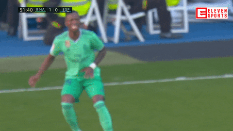

```{r packages-setup, include = FALSE}
library(tidyverse)
library(klippy)  #- remotes::install_github("rlesur/klippy")
library(knitr)
```

```{r chunk-setup, include = FALSE}
knitr::opts_chunk$set(echo = TRUE, eval = TRUE, message = FALSE, warning = FALSE, 
                      #results = "hold",
                      cache = FALSE, cache.path = "/caches/", comment = "#>",
                      #fig.width = 7, #fig.height= 7,   
                      #out.width = 7, out.height = 7,
                      collapse = TRUE,  fig.show = "hold",
                      fig.asp = 0.628, out.width = "75%", fig.align = "center")
knitr::opts_chunk$set(dev = "png", dev.args = list(type = "cairo-png"))
```


```{r options-setup, include = FALSE}
options(scipen = 999) #- para quitar la notación científica
options("yaml.eval.expr" = TRUE) 
```


```{r klippy, echo = FALSE}
klippy::klippy(position = c("top", "right")) #- remotes::install_github("rlesur/klippy")
```

```{r, include = FALSE}
library(rio)
library(ggplot2)
library(tidyverse)
library(tidyverse)
library(worldfootballR)
library(ggplot2)
library(RColorBrewer)
library(ggimage)
library(ggrepel)
library(ggpubr)
library(DT)
library(gganimate)
library(tidyverse)
library(worldfootballR)
library(ggsoccer)
library(tidyverse)
library(worldfootballR)
library(ggplot2)
library(RColorBrewer)
library(ggimage)
library(ggrepel)
library(ggpubr)
library(gridExtra)
library(treemap)
library(knitr)
library(kableExtra)
```
<hr class="linea-black">

<!-- El párrafo de abajo has de dejarlo casi igual, solo HAS de SUSTITUIR "perezp44" por tu usuario de Github-->
Trabajo elaborado para la asignatura "Programación y manejo de datos en la era del Big Data" de la Universitat de València durante el curso 2021-2022. El repo del trabajo está [aquí](https://github.com/alejandrocp00/trabajo_BigData){target="_blank"}. 

<!-- El párrafo de abajo has de dejarlo exactamente igual, NO HAS DE CAMBIAR NADA-->

La página web de la asignatura y los trabajos de mis compañeros pueden verse [aquí](https://perezp44.github.io/intro-ds-21-22-web/07-trabajos.html){target="_blank"}.


<hr class="linea-red">

# 1. Introducción


Desde hace muchos años, La Liga española ha sido una de las principales, e incluso la principal, liga de fútbol del mundo; sin embargo, tras la pandemia del COVID-21, otras ligas están por encima de esta, con más fichajes y más nivel (es el caso de la Premier). 
En este trabajo analizamos la situación actual de los equipos de primera división, un poquito de su evolución en los últimos años y terminamos con la parte del trabajo que más tiempo le he dedicado: Predicción de resultados de La Liga.

<center></center>

<br>

# 2. Datos

Los datos que he usado para este trabajo provienen del paquete [WorldFootballR](https://github.com/JaseZiv/worldfootballR), donde he podido obtener la mayoría de los datos acerca de los partidos (para la predicción), de los jugadores, de los fichajes...


El procesamiento de los datos lo veremos con detenimiento en cada uno de los apartados siguientes, pues con el paquete WorldFootballR podemos obtener datos de páginas web de deporte diferentes y cada dataset tendrá un tratamiento diferente

# 3. La Liga. 

## 3.1 Temporada actual. {.tabset}

### <FONT COLOR="d3a46a">**Evolución**</FONT>

En primer lugar, vamos a ver la situación actual del valor de los equipos, que, en principio, se esperaba que liderasen la clasificación este año. 

```{r, echo=FALSE}
valor<-get_player_market_values("Spain", 2021) 

valor<- valor %>% select(squad, player_num, player_age, player_name, player_nationality, current_club,player_foot,
                         date_joined, contract_expiry, player_market_value_euro)

a<-valor %>% group_by(squad) %>% summarise(valor = sum(player_market_value_euro))

b<-a %>% slice_max(valor, n=5) %>% mutate(escudo= c( "https://logodownload.org/wp-content/uploads/2016/03/real-madrid-logo-escudo-1.png",
                                                     "https://4.bp.blogspot.com/-WovWyVV6wK0/WW6rg05K9fI/AAAAAAABNU4/5rrftOg2aX88L8gLqYOnsi4vk5UO0VjTwCLcBGAs/s1600/Club%2BAtletico%2Bde%2BMadrid.png",
                                                     "http://assets.stickpng.com/images/584a9b3bb080d7616d298777.png", 
                                                    "http://assets.stickpng.com/images/584ad36ab519ea740933a8d3.png",
                                                    "http://assets.stickpng.com/thumbs/584ad291b519ea740933a8ba.png"))


p1<- ggplot(b, aes(x= reorder(squad, valor), y= valor, fill= squad), width=0.5) + 
  geom_bar(stat="identity") + scale_fill_brewer(palette = "Accent") + 
  geom_image(aes(image = escudo), size=0.1) + coord_flip() + theme(legend.position = "none")
p1
```

Aquí vemos los equipos con mayor valor de la liga, (suma del valor de todos los jugadores del equipo).


Sin embargo, el valor, no siempre asegura victorias, y es el caso de La Liga este año. 
Esta temporada está siendo especial, y lo podemos analizar con esta tendencia:

```{r, echo=FALSE}
clasificacion<- get_season_team_stats("ESP", "M", 2022, "1st", "league_table") %>% 
  select(Squad,Pts) %>% rename("squad"= "Squad")
a<-a %>% mutate(squad = ifelse(squad == "Athletic Bilbao", "Athletic Club", squad),
                squad = ifelse(squad == "Atlético de Madrid", "Atlético Madrid", squad),
                squad = ifelse(squad == "CA Osasuna", "Osasuna", squad),
                squad = ifelse(squad == "Cádiz CF", "Cádiz", squad),
                squad = ifelse(squad == "Celta de Vigo", "Celta Vigo", squad),
                squad = ifelse(squad == "Deportivo Alavés", "Alavés", squad),
                squad = ifelse(squad == "Elche CF", "Elche", squad),
                squad = ifelse(squad == "FC Barcelona", "Barcelona", squad),
                squad = ifelse(squad == "Getafe CF", "Getafe", squad),
                squad = ifelse(squad == "Granada CF", "Granada", squad),
                squad = ifelse(squad == "Levante UD", "Levante", squad),
                squad = ifelse(squad == "RCD Espanyol Barcelona", "Espanyol", squad),
                squad = ifelse(squad == "RCD Mallorca", "Mallorca", squad),
                squad = ifelse(squad == "Real Betis Balompié", "Betis", squad),
                squad = ifelse(squad == "Sevilla FC", "Sevilla", squad),
                squad = ifelse(squad == "Valencia CF", "Valencia", squad),
                squad = ifelse(squad == "Villarreal CF", "Villarreal", squad),)

c<-full_join(a,clasificacion) 

ggplot(data = c, aes(valor, Pts, label = squad)) +
  geom_point(aes(color=squad)) + 
  geom_smooth(method = "lm", se = FALSE) +
  geom_text_repel() +
  theme_classic() +
  xlab("Valor del equipo") +
  ylab("Puntos") +
  theme(legend.position = "none") +
  stat_cor(label.x = 50000000, label.y = 42) 
```

En este gráfico vemos cómo el valor del equipo no lo es todo, y con un valor muy bajo, observamos la situación del Rayo Vallecano, en puesto de Europa, por encima de mucho clubes con un valor de jugadores mayor.

También sorprende, negativamente, el Barcelona, que está firmando una temporada extraña dado el valor de su equipo.

La R= 0,8, nos indica que el 80% de los datos se ve representado por la tendencia mostrada en azul en el gráfico, que, aproximadamente nos indica que inversión habría que realizar para conseguir un número determinado de puntos.

### <FONT COLOR="d3a46a">**Código**</FONT>

```{r, eval=FALSE, include=TRUE}
valor<-get_player_market_values("Spain", 2021) 

valor<- valor %>% select(squad, player_num, player_age, player_name, player_nationality, current_club,player_foot,
                         date_joined, contract_expiry, player_market_value_euro)

a<-valor %>% group_by(squad) %>% summarise(valor = sum(player_market_value_euro))

b<-a %>% slice_max(valor, n=5) %>% mutate(escudo= c( "https://logodownload.org/wp-content/uploads/2016/03/real-madrid-logo-escudo-1.png",
                                                     "https://4.bp.blogspot.com/-WovWyVV6wK0/WW6rg05K9fI/AAAAAAABNU4/5rrftOg2aX88L8gLqYOnsi4vk5UO0VjTwCLcBGAs/s1600/Club%2BAtletico%2Bde%2BMadrid.png",
                                                     "http://assets.stickpng.com/images/584a9b3bb080d7616d298777.png", 
                                                    "http://assets.stickpng.com/images/584ad36ab519ea740933a8d3.png",
                                                    "http://assets.stickpng.com/thumbs/584ad291b519ea740933a8ba.png"))

p1<- ggplot(b, aes(x= reorder(squad, valor), y= valor, fill= squad), width=0.5) + 
  geom_bar(stat="identity") + scale_fill_brewer(palette = "Accent") + 
  geom_image(aes(image = escudo), size=0.1) + coord_flip() + theme(legend.position = "none")
p1

clasificacion<- get_season_team_stats("ESP", "M", 2022, "1st", "league_table") %>% 
  select(Squad,Pts) %>% rename("squad"= "Squad")
a<-a %>% mutate(squad = ifelse(squad == "Athletic Bilbao", "Athletic Club", squad),
                squad = ifelse(squad == "Atlético de Madrid", "Atlético Madrid", squad),
                squad = ifelse(squad == "CA Osasuna", "Osasuna", squad),
                squad = ifelse(squad == "Cádiz CF", "Cádiz", squad),
                squad = ifelse(squad == "Celta de Vigo", "Celta Vigo", squad),
                squad = ifelse(squad == "Deportivo Alavés", "Alavés", squad),
                squad = ifelse(squad == "Elche CF", "Elche", squad),
                squad = ifelse(squad == "FC Barcelona", "Barcelona", squad),
                squad = ifelse(squad == "Getafe CF", "Getafe", squad),
                squad = ifelse(squad == "Granada CF", "Granada", squad),
                squad = ifelse(squad == "Levante UD", "Levante", squad),
                squad = ifelse(squad == "RCD Espanyol Barcelona", "Espanyol", squad),
                squad = ifelse(squad == "RCD Mallorca", "Mallorca", squad),
                squad = ifelse(squad == "Real Betis Balompié", "Betis", squad),
                squad = ifelse(squad == "Sevilla FC", "Sevilla", squad),
                squad = ifelse(squad == "Valencia CF", "Valencia", squad),
                squad = ifelse(squad == "Villarreal CF", "Villarreal", squad),)

c<-full_join(a,clasificacion) 

ggplot(data = c, aes(valor, Pts, label = squad)) +
  geom_point(aes(color=squad)) + 
  geom_smooth(method = "lm", se = FALSE) +
  geom_text_repel() +
  theme_classic() +
  xlab("Valor del equipo") +
  ylab("Puntos") +
  theme(legend.position = "none") +
  stat_cor(label.x = 50000000, label.y = 42) 
```


## 3.1 Temporadas anteriores. {.tabset}

Este año, nos sorprende cómo la pelea por la liga no es entre el FC Barcelona, Atlético de Madrid y el Real Madrid.

### <FONT COLOR="d3a46a">**Últimos años**</FONT>

```{r, echo=FALSE}

veintidos<- get_season_team_stats("ESP", "M", 2022, "1st", "league_table") %>% select(Squad, Rk, Pts, Season_End_Year) 
veintiuno<- get_season_team_stats("ESP", "M", 2021, "1st", "league_table") %>% select(Squad, Rk, Pts, Season_End_Year)
veinte<- get_season_team_stats("ESP", "M", 2020, "1st", "league_table") %>% select(Squad, Rk, Pts, Season_End_Year)
diecinueve<- get_season_team_stats("ESP", "M", 2019, "1st", "league_table")%>% select(Squad, Rk, Pts, Season_End_Year)
dieciocho<- get_season_team_stats("ESP", "M", 2018, "1st", "league_table") %>% select(Squad, Rk, Pts, Season_End_Year)
diecisiete<- get_season_team_stats("ESP", "M", 2017, "1st", "league_table")%>% select(Squad, Rk, Pts, Season_End_Year)
dieciseis<- get_season_team_stats("ESP", "M", 2016, "1st", "league_table") %>% select(Squad, Rk, Pts, Season_End_Year)
quince<- get_season_team_stats("ESP", "M", 2015, "1st", "league_table") %>% select(Squad, Rk, Pts, Season_End_Year)
catorce<- get_season_team_stats("ESP", "M", 2014, "1st", "league_table")%>% select(Squad, Rk, Pts, Season_End_Year)
trece<- get_season_team_stats("ESP", "M", 2013, "1st", "league_table") %>% select(Squad, Rk, Pts, Season_End_Year)
doce<- get_season_team_stats("ESP", "M", 2012, "1st", "league_table") %>% select(Squad, Rk, Pts, Season_End_Year)
once<- get_season_team_stats("ESP", "M", 2011, "1st", "league_table")%>% select(Squad, Rk, Pts, Season_End_Year)
diez<- get_season_team_stats("ESP", "M", 2010, "1st", "league_table")%>% select(Squad, Rk, Pts, Season_End_Year)

a<-full_join(veintidos, veintiuno)
b<-full_join(a,veinte)
c<-full_join(b,diecinueve)
d<-full_join(c,dieciocho)
e<-full_join(d,diecisiete)
f<-full_join(e,dieciseis)
g<-full_join(f,quince)
h<-full_join(g,catorce)
i<-full_join(h,trece)
j<-full_join(i,doce)
k<-full_join(j,once)
l<-full_join(k,diez) %>% filter(!Season_End_Year=="2022")

m<- l %>% group_by(Season_End_Year) %>% filter(Squad %in% c( "Real Madrid", "Barcelona", "Atlético Madrid"))

ggplot(m, aes(Season_End_Year, Rk, color=Squad)) + geom_line() + 
  theme(legend.position = "none") 


x<-ggplot(m,aes(x= Season_End_Year, y= Rk)) + 
  labs(title = "Evolución posiciones en liga",
       x= "Año",
       y= "Posición",
       color = "Equipo") +
  geom_point(aes(color= Squad), size= 3) +
  geom_line(aes(color= Squad), size= 1.5) + 
  scale_color_manual(values= c("red", "#900C3F", "white"),
                     labels = c("Atlético de Madrid",
                                "FC Barcelona",
                                "Real Madrid"))+
  theme_minimal() +
  theme(plot.title = element_text(size = 20, face = "bold",
                                  hjust = 0.5),
        axis.title.x = element_text(size = 13, hjust = 1,
                                    vjust = 0),
        axis.title.y = element_text(size = 13, hjust = 1, vjust = 1),
        legend.title = element_text(face = "bold"),
        plot.background = element_rect(colour = "#B082FF"),
        panel.background = element_rect(colour = "#B082FF")) +
  transition_reveal(Season_End_Year) + 
  view_follow()

x + theme(panel.grid.major = element_line(colour = "#B082FF"),
    panel.grid.minor = element_line(colour = "#B082FF"),
    panel.background = element_rect(fill = "#B082FF"),
    plot.background = element_rect(fill = "#B082FF"))
```

Aquí vemos la evolución de los últimos años, siendo y la posición en la liga; es decir, cuanto más abajo, mejor.

Este año, como dijimos está siendo diferente y los equipos más pequeños están consiguiendo vencer al FC Barcelona y al Atlético de Madrid; quizás es el año del Pancrudo FC, quién sabe.

### <FONT COLOR="d3a46a">**Código**</FONT>

```{r, include=TRUE, eval=FALSE}

veintidos<- get_season_team_stats("ESP", "M", 2022, "1st", "league_table") %>% select(Squad, Rk, Pts, Season_End_Year) 
veintiuno<- get_season_team_stats("ESP", "M", 2021, "1st", "league_table") %>% select(Squad, Rk, Pts, Season_End_Year)
veinte<- get_season_team_stats("ESP", "M", 2020, "1st", "league_table") %>% select(Squad, Rk, Pts, Season_End_Year)
diecinueve<- get_season_team_stats("ESP", "M", 2019, "1st", "league_table")%>% select(Squad, Rk, Pts, Season_End_Year)
dieciocho<- get_season_team_stats("ESP", "M", 2018, "1st", "league_table") %>% select(Squad, Rk, Pts, Season_End_Year)
diecisiete<- get_season_team_stats("ESP", "M", 2017, "1st", "league_table")%>% select(Squad, Rk, Pts, Season_End_Year)
dieciseis<- get_season_team_stats("ESP", "M", 2016, "1st", "league_table") %>% select(Squad, Rk, Pts, Season_End_Year)
quince<- get_season_team_stats("ESP", "M", 2015, "1st", "league_table") %>% select(Squad, Rk, Pts, Season_End_Year)
catorce<- get_season_team_stats("ESP", "M", 2014, "1st", "league_table")%>% select(Squad, Rk, Pts, Season_End_Year)
trece<- get_season_team_stats("ESP", "M", 2013, "1st", "league_table") %>% select(Squad, Rk, Pts, Season_End_Year)
doce<- get_season_team_stats("ESP", "M", 2012, "1st", "league_table") %>% select(Squad, Rk, Pts, Season_End_Year)
once<- get_season_team_stats("ESP", "M", 2011, "1st", "league_table")%>% select(Squad, Rk, Pts, Season_End_Year)
diez<- get_season_team_stats("ESP", "M", 2010, "1st", "league_table")%>% select(Squad, Rk, Pts, Season_End_Year)

a<-full_join(veintidos, veintiuno)
b<-full_join(a,veinte)
c<-full_join(b,diecinueve)
d<-full_join(c,dieciocho)
e<-full_join(d,diecisiete)
f<-full_join(e,dieciseis)
g<-full_join(f,quince)
h<-full_join(g,catorce)
i<-full_join(h,trece)
j<-full_join(i,doce)
k<-full_join(j,once)
l<-full_join(k,diez) %>% filter(!Season_End_Year=="2022")

m<- l %>% group_by(Season_End_Year) %>% filter(Squad %in% c( "Real Madrid", "Barcelona", "Atlético Madrid"))

ggplot(m, aes(Season_End_Year, Rk, color=Squad)) + geom_line() + 
  theme(legend.position = "none") 


x<-ggplot(m,aes(x= Season_End_Year, y= Rk)) + 
  labs(title = "Evolución posiciones en liga",
       x= "Año",
       y= "Posición",
       color = "Equipo") +
  geom_point(aes(color= Squad), size= 3) +
  geom_line(aes(color= Squad), size= 1.5) + 
  scale_color_manual(values= c("red", "#900C3F", "white"),
                     labels = c("Atlético de Madrid",
                                "FC Barcelona",
                                "Real Madrid"))+
  theme_minimal() +
  theme(plot.title = element_text(size = 20, face = "bold",
                                  hjust = 0.5),
        axis.title.x = element_text(size = 13, hjust = 1,
                                    vjust = 0),
        axis.title.y = element_text(size = 13, hjust = 1, vjust = 1),
        legend.title = element_text(face = "bold"),
        plot.background = element_rect(colour = "#B082FF"),
        panel.background = element_rect(colour = "#B082FF")) +
  transition_reveal(Season_End_Year) + 
  view_follow()

x + theme(panel.grid.major = element_line(colour = "#B082FF"),
    panel.grid.minor = element_line(colour = "#B082FF"),
    panel.background = element_rect(fill = "#B082FF"),
    plot.background = element_rect(fill = "#B082FF"))
```

# 4. Otras ligas. {.tabset}

## <FONT COLOR="d3a46a">**Inversión**</FONT>

Es necesario ver una de las razones por las que poco a poco La Liga ha ido perdiendo calidad frente a otras ligas, y esa razón es la inversión en jugadores de alto nivel:

```{r, echo=FALSE}
library(tidyverse)
library(worldfootballR)


library(gridExtra)

library(readr)
spain2020 <- read_csv("./datos/spain2020.csv")
england2020 <- read_csv("./datos/england2020.csv")
france2020 <- read_csv("./datos/france2020.csv")

a<-spain2020 %>% filter(!is.na(transfer_fee)) %>% filter(transfer_type=="Arrivals") %>%
  select(country,season, player_name, team_name,transfer_fee, player_age, player_position)%>% 
  mutate(suma= sum(transfer_fee))
b<- england2020 %>% filter(!is.na(transfer_fee)) %>%
  select(country,season, player_name, team_name,transfer_fee, player_age, player_position)%>% 
  mutate(suma= sum(transfer_fee))
c<- france2020 %>% filter(!is.na(transfer_fee)) %>%
  select(country,season, player_name, team_name,transfer_fee, player_age, player_position) %>% 
  mutate(suma= sum(transfer_fee))


spain2015 <- read_csv("./datos/spain2015.csv")
england2015 <- read_csv("./datos/england2015.csv")
france2015 <- read_csv("./datos/france2015.csv")

d<- spain2015%>% filter(!is.na(transfer_fee)) %>% filter(transfer_type=="Arrivals") %>%
  select(country,season, player_name, team_name,transfer_fee, player_age, player_position)%>% 
  mutate(suma= sum(transfer_fee))
e<-england2015%>% filter(!is.na(transfer_fee)) %>% filter(transfer_type=="Arrivals") %>%
  select(country,season, player_name, team_name,transfer_fee, player_age, player_position)%>% 
  mutate(suma= sum(transfer_fee))
f<-france2015%>% filter(!is.na(transfer_fee)) %>% filter(transfer_type=="Arrivals") %>%
  select(country,season, player_name, team_name,transfer_fee, player_age, player_position)%>% 
  mutate(suma= sum(transfer_fee))

library(ggplot2)

g<-full_join(a, b)
h<-full_join(g,c)
i<-full_join(d,e)
j<-full_join(i,f) %>% filter(!is.na(country))


bar1<-ggplot(h) +
  aes(x = country, fill = country, weight = suma) +
  geom_bar() +
  scale_fill_viridis_d(option = "viridis")+ theme_light()+
  theme(plot.subtitle = element_text(size = 10),
          axis.title = element_text(size = 9),
          plot.title = element_text(size = 13)) + 
  labs(title = "Inversión en jugadores por país",
       x = "Liga (País)", y = "Inversión en jugadores",
       subtitle = "Año: 2020") + theme(legend.position = "none")

bar2<- ggplot(j) +
  aes(x = country, fill = country, weight = suma) +
  geom_bar() +
  scale_fill_viridis_d(option = "viridis")+ theme_light()+
  theme(plot.subtitle = element_text(size = 10),
        axis.title = element_text(size = 9),
        plot.title = element_text(size = 13)) + 
  labs(title = "Inversión en jugadores por país",
       x = "Liga (País)", y = "Inversión en jugadores",
       subtitle = "Año: 2015") + theme(legend.position = "none")

grid.arrange(bar1, bar2, ncol = 2, widths = c(4.5, 3.5))
```

## <FONT COLOR="d3a46a">**Código**</FONT>

```{r, eval=FALSE, include=TRUE}
library(tidyverse)
library(worldfootballR)


library(gridExtra)

library(readr)
spain2020 <- read_csv("./datos/spain2020.csv")
england2020 <- read_csv("./datos/england2020.csv")
france2020 <- read_csv("./datos/france2020.csv")

a<-spain2020 %>% filter(!is.na(transfer_fee)) %>% filter(transfer_type=="Arrivals") %>%
  select(country,season, player_name, team_name,transfer_fee, player_age, player_position)%>% 
  mutate(suma= sum(transfer_fee))
b<- england2020 %>% filter(!is.na(transfer_fee)) %>%
  select(country,season, player_name, team_name,transfer_fee, player_age, player_position)%>% 
  mutate(suma= sum(transfer_fee))
c<- france2020 %>% filter(!is.na(transfer_fee)) %>%
  select(country,season, player_name, team_name,transfer_fee, player_age, player_position) %>% 
  mutate(suma= sum(transfer_fee))


spain2015 <- read_csv("./datos/spain2015.csv")
england2015 <- read_csv("./datos/england2015.csv")
france2015 <- read_csv("./datos/france2015.csv")

d<- spain2015%>% filter(!is.na(transfer_fee)) %>% filter(transfer_type=="Arrivals") %>%
  select(country,season, player_name, team_name,transfer_fee, player_age, player_position)%>% 
  mutate(suma= sum(transfer_fee))
e<-england2015%>% filter(!is.na(transfer_fee)) %>% filter(transfer_type=="Arrivals") %>%
  select(country,season, player_name, team_name,transfer_fee, player_age, player_position)%>% 
  mutate(suma= sum(transfer_fee))
f<-france2015%>% filter(!is.na(transfer_fee)) %>% filter(transfer_type=="Arrivals") %>%
  select(country,season, player_name, team_name,transfer_fee, player_age, player_position)%>% 
  mutate(suma= sum(transfer_fee))

library(ggplot2)

g<-full_join(a, b)
h<-full_join(g,c)
i<-full_join(d,e)
j<-full_join(i,f) %>% filter(!is.na(country))


bar1<-ggplot(h) +
  aes(x = country, fill = country, weight = suma) +
  geom_bar() +
  scale_fill_viridis_d(option = "viridis")+ theme_light()+
  theme(plot.subtitle = element_text(size = 10),
          axis.title = element_text(size = 9),
          plot.title = element_text(size = 13)) + 
  labs(title = "Inversión en jugadores por país",
       x = "Liga (País)", y = "Inversión en jugadores",
       subtitle = "Año: 2020") + theme(legend.position = "none")

bar2<- ggplot(j) +
  aes(x = country, fill = country, weight = suma) +
  geom_bar() +
  scale_fill_viridis_d(option = "viridis")+ theme_light()+
  theme(plot.subtitle = element_text(size = 10),
        axis.title = element_text(size = 9),
        plot.title = element_text(size = 13)) + 
  labs(title = "Inversión en jugadores por país",
       x = "Liga (País)", y = "Inversión en jugadores",
       subtitle = "Año: 2015") + theme(legend.position = "none")

grid.arrange(bar1, bar2, ncol = 2, widths = c(3.5, 3.5))
```

# 5. Real Madrid y Vinicius Jr. 

Soy del Real Madrid, y Vinicius es un crack, por tanto, me parecía conveniente dedicarle un pequeño apartado a Vini:

## 5.1 Vinicius {.tabset}

### <FONT COLOR="d3a46a">**Vinicius**</FONT>

El año pasado Vinicius no andaba muy acertado de cara a portería...

```{r, echo=FALSE}

veinte<-understat_league_match_results("La liga", 2020)
uno<-understat_league_match_results("La liga", 2021)


#Otra info-----

team_urls<- understat_team_meta("Real Madrid")
RMA<-understat_team_stats_breakdown("https://understat.com/team/Real_Madrid/2020")

vini<-understat_player_shots("https://understat.com/player/7008")

library(ggplot2)

vini2<-vini %>% mutate(X= X*100) %>% mutate(Y = Y*100)

vini2<- vini2 %>% mutate(resultado = case_when( result == "Goal" ~ "1",
                                                result == "MissedShots" ~ "0.4",
                                                result == "BlockedShot" ~ "0.4",
                                                result == "SavedShot" ~ "0.4",
                                                result == "ShotOnPost" ~ "0.3")) %>%
  mutate(resultado= as.numeric(resultado)) %>% mutate(resulta2 = 1-resultado) %>%
  filter(!season == 2021)
  
  
ggplot(vini2) + annotate_pitch(colour = "white",
                                 fill   = "springgreen4",
                                 limits = FALSE) +
  geom_point(aes(x=X, y=100-Y, colour= shotType, alpha = resultado), size=7) +  
  coord_flip(xlim = c(60, 101), ylim = c(-1, 101)) +
  theme_pitch() +  theme(panel.background = element_rect(fill = "springgreen4"))
```

<br>

La verdad que hasta este año Vinicius fallaba mucho, podemos ver en transparente todos los tiro que hizo y los puntos no transparentes son los que acabaron en gol (pocos).

Sin embargo, este año ha cambiado:

```{r, echo=FALSE}

vini3<-vini %>% mutate(X= X*100) %>% mutate(Y = Y*100)

vini3<- vini3 %>% mutate(resultado = case_when( result == "Goal" ~ "1",
                                                result == "MissedShots" ~ "0.6",
                                                result == "BlockedShot" ~ "0.6",
                                                result == "SavedShot" ~ "0.5",
                                                result == "ShotOnPost" ~ "0.6")) %>%
  mutate(resultado= as.numeric(resultado)) %>% mutate(resulta2 = 1-resultado) %>%
  filter(season == 2021)


ggplot(vini3) + annotate_pitch(colour = "white",
                               fill   = "springgreen4",
                               limits = FALSE) +
  geom_point(aes(x=X, y=100-Y, colour= shotType, alpha = resultado), size=7) +  
  coord_flip(xlim = c(60, 101), ylim = c(-1, 101)) +
  theme_pitch() +  theme(panel.background = element_rect(fill = "springgreen4"))

```

Vemos cómo este año ya ha marcado un porcentaje mucho mayor de goles. 

<center></center>

### <FONT COLOR="d3a46a">**Código**</FONT>

```{r, include=TRUE, eval=FALSE}

veinte<-understat_league_match_results("La liga", 2020)
uno<-understat_league_match_results("La liga", 2021)


#Otra info-----

team_urls<- understat_team_meta("Real Madrid")
RMA<-understat_team_stats_breakdown("https://understat.com/team/Real_Madrid/2020")

vini<-understat_player_shots("https://understat.com/player/7008")

library(ggplot2)

vini2<-vini %>% mutate(X= X*100) %>% mutate(Y = Y*100)

vini2<- vini2 %>% mutate(resultado = case_when( result == "Goal" ~ "1",
                                                result == "MissedShots" ~ "0.4",
                                                result == "BlockedShot" ~ "0.4",
                                                result == "SavedShot" ~ "0.4",
                                                result == "ShotOnPost" ~ "0.3")) %>%
  mutate(resultado= as.numeric(resultado)) %>% mutate(resulta2 = 1-resultado) %>%
  filter(!season == 2021)
  
  
ggplot(vini2) + annotate_pitch(colour = "white",
                                 fill   = "springgreen4",
                                 limits = FALSE) +
  geom_point(aes(x=X, y=100-Y, colour= shotType, alpha = resultado), size=7) +  
  coord_flip(xlim = c(60, 101), ylim = c(-1, 101)) +
  theme_pitch() +  theme(panel.background = element_rect(fill = "springgreen4"))


vini3<-vini %>% mutate(X= X*100) %>% mutate(Y = Y*100)

vini3<- vini3 %>% mutate(resultado = case_when( result == "Goal" ~ "1",
                                                result == "MissedShots" ~ "0.6",
                                                result == "BlockedShot" ~ "0.6",
                                                result == "SavedShot" ~ "0.5",
                                                result == "ShotOnPost" ~ "0.6")) %>%
  mutate(resultado= as.numeric(resultado)) %>% mutate(resulta2 = 1-resultado) %>%
  filter(season == 2021)


ggplot(vini3) + annotate_pitch(colour = "white",
                               fill   = "springgreen4",
                               limits = FALSE) +
  geom_point(aes(x=X, y=100-Y, colour= shotType, alpha = resultado), size=7) +  
  coord_flip(xlim = c(60, 101), ylim = c(-1, 101)) +
  theme_pitch() +  theme(panel.background = element_rect(fill = "springgreen4"))
```


## 5.2 Asistentes {.tabset}

### <FONT COLOR="d3a46a">**Asistentes**</FONT>

Los principales asistentes del Real Madrid esta temporada han sido los siguientes:

```{r, echo=FALSE}
a<-get_match_report("https://fbref.com/en/matches/f6fab33c/Getafe-Real-Madrid-January-2-2022-La-Liga")
b<-get_match_summary("https://fbref.com/en/matches/f6fab33c/Getafe-Real-Madrid-January-2-2022-La-Liga")
c<-get_match_lineups("https://fbref.com/en/matches/f6fab33c/Getafe-Real-Madrid-January-2-2022-La-Liga")
d<-get_advanced_match_stats("https://fbref.com/en/matches/f6fab33c/Getafe-Real-Madrid-January-2-2022-La-Liga", "passing", "team")
e<-vini<-understat_player_shots("https://understat.com/player/7008")

e<-e %>% select(minute, player_assisted) %>% group_by(player_assisted) %>% count() %>% 
  filter(!is.na(player_assisted))


m1<-treemap(e, index = "player_assisted",
            vSize = "n",
            type = "index",
            palette = "BrBG",
            border.lwds=3,
            border.col=c("white"),
            fontface.labels=1,
            bg.labels=c("transparent"))

```

Esto explica gran parte de los buenos resultados de Vinicius, el delantero del equipo, Benzema es el principal asistente del Real Madrid, ayudando mucho a quien juega de extremo


<center></center>


### <FONT COLOR="d3a46a">**Código**</FONT>

```{r, include=TRUE, eval=FALSE}
a<-get_match_report("https://fbref.com/en/matches/f6fab33c/Getafe-Real-Madrid-January-2-2022-La-Liga")
b<-get_match_summary("https://fbref.com/en/matches/f6fab33c/Getafe-Real-Madrid-January-2-2022-La-Liga")
c<-get_match_lineups("https://fbref.com/en/matches/f6fab33c/Getafe-Real-Madrid-January-2-2022-La-Liga")
d<-get_advanced_match_stats("https://fbref.com/en/matches/f6fab33c/Getafe-Real-Madrid-January-2-2022-La-Liga", "passing", "team")
e<-vini<-understat_player_shots("https://understat.com/player/7008")

e<-e %>% select(minute, player_assisted) %>% group_by(player_assisted) %>% count() %>% 
  filter(!is.na(player_assisted))


m1<-treemap(e, index = "player_assisted",
            vSize = "n",
            type = "index",
            palette = "BrBG",
            border.lwds=3,
            border.col=c("white"),
            fontface.labels=1,
            bg.labels=c("transparent"))

```

# 6. Predicciones partidos de la liga

Esta es la parte que más tiempo le he dedicado, he cogido mucha información acerca de las estadísticas de los equipos de La Liga y he creado predicciones de los partidos del fin de semana del 9 de enero
(Estas predicciones se han empezado a hacer antes de los partidos del 31 de Diciembre, por lo que los datos de esta jornada no están incluídos).

Vamos a tomar un ejemplo primero de un partido, el Real Madrid Valencia, donde explicaré como lo he hecho y después, usaré el mismo código para todos los partidos y ya veremos si acierto o no...

## 6.1 Datos

En este caso, vamos a ver el código, pues la idea es que sea fácil de repetir para cualquier partido y he puesto unas pequeñas instrucciones para copiar y pegar el código en un Rscript y poder usarlo para cada partido

```{r,eval=FALSE}
#Intrucciones:
#1- Hacer Ctrl+f y reemplazar (Replace): Real Madrid por el equipo local y Valencia por el equipo Visitante
#2- Modificiar la línea que pone IMPORTANTÍSIMO
#3- Reemplaza 2021-12-31 por la fecha del primer partido de la jornada que estudiamos (haciendo lo mismo que en el paso 1)

library(tidyverse)
library(worldfootballR)

#Jugando con FBREF------

clasificacion<- get_season_team_stats("ESP", "M", 2022, "1st", "league_table") %>% 
  select(Squad,Rk,Pts,xG, xGA) 

datos<- get_match_results("ESP", "M", 2022, "1st")
```

Las instrucciones son simples, he intentado que sea todo bastante "automático" para cambiar lo menos posible.
Los datos de donde siempre, tomamos esta temporada, y a jugar...

## 6.2 +1, -1 ...

Como no sabía muy bien como usar los datos mi idea fue simple, partimos de un marcados = 0, y si el equipo Local gana al Visitante en un ámbito (por ejemplo, de media tira más a puerta), le sumo +1 al marcador; si es al revés, le resto -1. En el caso de que el marcador final quede, por ejemplo: 

Marcador: -6; es que el equipo visitante tiene más probabilidad de ganar. Vamos allá:

```{r, eval=FALSE}
#Vamos a ver la probabilidad de que gane el Real Madrid

ve<- clasificacion %>% 
  filter(Squad %in% c("Real Madrid", "Valencia")) %>% #Poner los equipos que quieras (Local y Visitante)
  mutate(orden= c(2,1)) %>% slice_min(orden, n=2) %>%
  mutate(DxG= xG- lag(xG)) %>% mutate(DPts= Pts - lag(Pts)) %>%
  mutate(DxGA= xGA - lag(xGA)) 

#IMPORTANTÍSIMO, cambiar los números,--> (1,2): Si equipo local es alfabéticamente superior al equipo visitante ej: Real Madrid>Valencia; en caso contrario: (2,1)


prueba<- ve %>% mutate(prueba = 0) %>% 
  mutate( prueba= ifelse(DPts>15, prueba+1, prueba),
          prueba= ifelse(DPts<(-15), prueba-1, prueba),
          prueba= ifelse(DxG>0, prueba+1, prueba-1),
          prueba= ifelse(DxG>10, prueba+1, prueba),
          prueba= ifelse(DxG<(-10), prueba-1, prueba),
          prueba= ifelse(DxGA>0, prueba -1, prueba+1))

#Poner el equipo Local (En ambos) 
#Cuidado, los datos son del 2021-12-31, se debería poner la fecha de la última jornada

Localv<- datos %>% filter(Home == "Real Madrid") %>% filter(Date<"2021-12-31") %>%
  slice_max(Date, n=6) %>% select(Home, HomeGoals, Away, AwayGoals) %>% 
  mutate(Ganador= HomeGoals-AwayGoals) %>% 
  mutate(Resultado = ifelse(Ganador >=1, "1", Ganador)) %>%
  mutate(Resultado = as.numeric( ifelse(Resultado <= -1, "-1", Resultado))) %>%
  summarise(Localv=sum(Resultado)) %>% mutate(Squad= "Real Madrid")

Visitantev <- datos %>% filter(Away=="Real Madrid")%>% filter(Date<"2021-12-31") %>%
  slice_max(Date, n=6) %>% select(Home, HomeGoals, Away, AwayGoals) %>% 
  mutate(Ganador= HomeGoals-AwayGoals) %>% 
  mutate(Resultado = ifelse(Ganador >=1, "-1", Ganador)) %>%
  mutate(Resultado = as.numeric(ifelse(Resultado >= 1, "1", Resultado))) %>% 
  summarise(Visitantev=sum(Resultado)) %>% mutate(Squad= "Real Madrid")

#Poner el equipo visitante (En ambos) 
#Cuidado, los datos son del 2021-12-31, se debería poner la fecha de la última jornada

Locale<- datos %>% filter(Home == "Valencia") %>% filter(Date<"2021-12-31") %>%
  slice_max(Date, n=6) %>% select(Home, HomeGoals, Away, AwayGoals) %>% 
  mutate(Ganador= HomeGoals-AwayGoals) %>% 
  mutate(Resultado = ifelse(Ganador >=1, "1", Ganador)) %>%
  mutate(Resultado = as.numeric( ifelse(Resultado <= -1, "-1", Resultado))) %>%
  summarise(Localv=sum(Resultado)) %>% mutate(Squad= "Valencia")

Visitantee <- datos %>% filter(Away=="Valencia")%>% filter(Date<"2021-12-31") %>%
  slice_max(Date, n=6) %>% select(Home, HomeGoals, Away, AwayGoals) %>% 
  mutate(Ganador= HomeGoals-AwayGoals) %>% 
  mutate(Resultado = ifelse(Ganador >=1, "-1", Ganador)) %>%
  mutate(Resultado = as.numeric(ifelse(Resultado >= 1, "1", Resultado))) %>% 
  summarise(Visitantee=sum(Resultado)) %>% mutate(Squad= "Valencia")

prueba<-full_join(prueba,Localv) 
prueba<-full_join(prueba, Visitantee)
prueba<-prueba %>% mutate(DGan= Localv-lag(Visitantee)) %>%
  mutate(prueba= ifelse(DGan>0, prueba+1, prueba),
         prueba= ifelse(DGan<0, prueba-1, prueba))


#Ahora vamos a crear una variable que sea la suma de todas las variables de defensa: presión con éxito, bloquear un pase... pero como tienen distintas magnitudes, vamos a tipificar la variable para poder sumarlas

vamos<-get_season_team_stats(country = "ESP", gender = "M", season_end_year = 2022,tier="1st", stat_type =  "defense")


vamosT<- vamos %>% select(Squad,TklW_Tackles, Succ_Pressures, Blocks_Blocks) %>% 
  mutate(TklW_Tackles = (TklW_Tackles- mean(TklW_Tackles))/sd(TklW_Tackles)) %>%
  mutate(Succ_Pressures = (Succ_Pressures- mean(Succ_Pressures))/sd(Succ_Pressures)) %>%
  mutate(Blocks_Blocks = (Blocks_Blocks- mean(Blocks_Blocks))/sd(Blocks_Blocks)) %>% 
  filter(Squad %in% c("vs Valencia", "Real Madrid")) %>% #vs es el equipo visitante y el otro el equipo local
  mutate(Squad = ifelse(Squad=="vs Valencia", "Valencia", Squad)) #Esto es un coñazo pero hay que cambiarlo


prueba<-full_join(prueba, vamosT) %>% 
  mutate(Ddef= (TklW_Tackles - lag(TklW_Tackles)) + (Succ_Pressures - lag(Succ_Pressures))+ (Blocks_Blocks- lag(Blocks_Blocks)))

prueba<- prueba %>% mutate(prueba = ifelse(Ddef > 0, prueba+1 , prueba-1))

#Vamos a hacer lo mismo con los pases:

vamos2<-get_season_team_stats(country = "ESP", gender = "M", season_end_year = 2022,tier="1st", stat_type = "passing")


vamosT2<- vamos2 %>% select(Squad,Cmp_percent_Total,Ast,A_minus_xA, Final_Third, Prog)%>% 
  mutate(Cmp_percent_Total = (Cmp_percent_Total- mean(Cmp_percent_Total))/sd(Cmp_percent_Total)) %>%
  mutate(Ast = (Ast- mean(Ast))/sd(Ast)) %>%
  mutate(A_minus_xA = (A_minus_xA- mean(A_minus_xA))/sd(A_minus_xA)) %>% 
  mutate(Final_Third = (Final_Third- mean(Final_Third))/sd(Final_Third)) %>%
  mutate(Prog = (Prog- mean(Prog))/sd(Prog)) %>%
  filter(Squad %in% c("vs Valencia", "Real Madrid")) %>% #vs es el equipo visitante y el otro el equipo local
  mutate(Squad = ifelse(Squad=="vs Valencia", "Valencia", Squad)) #Esto es un coñazo pero hay que cambiarlo

prueba<-full_join(prueba, vamosT2) %>% 
  mutate(Dpas= (Cmp_percent_Total - lag(Cmp_percent_Total)) + (Ast - lag(Ast))+ (A_minus_xA- lag(A_minus_xA))+ (Final_Third - lag(Final_Third))+ (Prog- lag(Prog)))

prueba<- prueba %>% mutate(prueba = ifelse(Dpas > 0, prueba+1 , prueba-1))

#Lo mismo con los disparos:

vamos3<-get_season_team_stats(country = "ESP", gender = "M", season_end_year = 2022,tier="1st", stat_type = "shooting")


vamosT3<- vamos3 %>% select(Squad,Gls_Standard, SoT_Standard,G_per_Sh_Standard)  %>% 
  mutate(Gls_Standard = (Gls_Standard- mean(Gls_Standard))/sd(Gls_Standard)) %>%
  mutate(SoT_Standard = (SoT_Standard- mean(SoT_Standard))/sd(SoT_Standard)) %>%
  mutate(G_per_Sh_Standard = (G_per_Sh_Standard- mean(G_per_Sh_Standard))/sd(G_per_Sh_Standard)) %>% 
  filter(Squad %in% c("vs Valencia", "Real Madrid")) %>% #vs es el equipo visitante y el otro el equipo local
  mutate(Squad = ifelse(Squad=="vs Valencia", "Valencia", Squad)) #Esto es un coñazo pero hay que cambiarlo

prueba<-full_join(prueba, vamosT3) %>% 
  mutate(Ddis= (Gls_Standard - lag(Gls_Standard)) + (SoT_Standard - lag(SoT_Standard))+ (G_per_Sh_Standard- lag(G_per_Sh_Standard)))

prueba<- prueba %>% mutate(prueba = ifelse(Ddis > 0, prueba+1 , prueba-1))

#Limpio un poquito el DF prueba:

prueba<- prueba %>% select(Squad, orden, prueba)


#Hago lo mismo con la posesión:

vamos4<-get_season_team_stats(country = "ESP", gender = "M", season_end_year = 2022,tier="1st", stat_type = "possession")


vamosT4<- vamos4 %>% select(Squad, Poss,Succ_percent_Dribbles, Final_Third_Carries)%>% 
  mutate(Poss = (Poss- mean(Poss))/sd(Poss)) %>%
  mutate(Succ_percent_Dribbles = (Succ_percent_Dribbles- mean(Succ_percent_Dribbles))/sd(Succ_percent_Dribbles)) %>%
  mutate(Final_Third_Carries = (Final_Third_Carries- mean(Final_Third_Carries))/sd(Final_Third_Carries)) %>% 
  filter(Squad %in% c("vs Valencia", "Real Madrid")) %>% #vs es el equipo visitante y el otro el equipo local
  mutate(Squad = ifelse(Squad=="vs Valencia", "Valencia", Squad)) #Esto es un rollo pero hay que cambiarlo

prueba<-full_join(prueba, vamosT4) %>% 
  mutate(Ddis= (Poss - lag(Poss)) + (Succ_percent_Dribbles - lag(Succ_percent_Dribbles))+ (Final_Third_Carries- lag(Final_Third_Carries)))

prueba<- prueba %>% mutate(prueba = ifelse(Ddis > 0, prueba+1 , prueba-1))

```

En vez de marcador, lo llamé prueba, como podemos ver. Y a estas alturas, después de aplicar los criterios que he considerado, está tal que así:

```{r, echo=FALSE}
clasificacion<- get_season_team_stats("ESP", "M", 2022, "1st", "league_table") %>% 
  select(Squad,Rk,Pts,xG, xGA) 

datos<- get_match_results("ESP", "M", 2022, "1st")

#Vamos a ver la probabilidad de que gane el Real Madrid

ve<- clasificacion %>% 
  filter(Squad %in% c("Real Madrid", "Valencia")) %>% #Poner los equipos que quieras (Local y Visitante)
  mutate(orden= c(2,1)) %>% slice_min(orden, n=2) %>%
  mutate(DxG= xG- lag(xG)) %>% mutate(DPts= Pts - lag(Pts)) %>%
  mutate(DxGA= xGA - lag(xGA)) 

#IMPORTANTÍSIMO, cambiar los números,--> (1,2): Si equipo local es alfabéticamente superior al equipo visitante ej: Real Madrid>Valencia; en caso contrario: (2,1)


prueba<- ve %>% mutate(prueba = 0) %>% 
  mutate( prueba= ifelse(DPts>15, prueba+1, prueba),
          prueba= ifelse(DPts<(-15), prueba-1, prueba),
          prueba= ifelse(DxG>0, prueba+1, prueba-1),
          prueba= ifelse(DxG>10, prueba+1, prueba),
          prueba= ifelse(DxG<(-10), prueba-1, prueba),
          prueba= ifelse(DxGA>0, prueba -1, prueba+1))

#Poner el equipo Local (En ambos) 
#Cuidado, los datos son del 2021-12-31, se debería poner la fecha de la última jornada

Localv<- datos %>% filter(Home == "Real Madrid") %>% filter(Date<"2021-12-31") %>%
  slice_max(Date, n=6) %>% select(Home, HomeGoals, Away, AwayGoals) %>% 
  mutate(Ganador= HomeGoals-AwayGoals) %>% 
  mutate(Resultado = ifelse(Ganador >=1, "1", Ganador)) %>%
  mutate(Resultado = as.numeric( ifelse(Resultado <= -1, "-1", Resultado))) %>%
  summarise(Localv=sum(Resultado)) %>% mutate(Squad= "Real Madrid")

Visitantev <- datos %>% filter(Away=="Real Madrid")%>% filter(Date<"2021-12-31") %>%
  slice_max(Date, n=6) %>% select(Home, HomeGoals, Away, AwayGoals) %>% 
  mutate(Ganador= HomeGoals-AwayGoals) %>% 
  mutate(Resultado = ifelse(Ganador >=1, "-1", Ganador)) %>%
  mutate(Resultado = as.numeric(ifelse(Resultado >= 1, "1", Resultado))) %>% 
  summarise(Visitantev=sum(Resultado)) %>% mutate(Squad= "Real Madrid")

#Poner el equipo visitante (En ambos) 
#Cuidado, los datos son del 2021-12-31, se debería poner la fecha de la última jornada

Locale<- datos %>% filter(Home == "Valencia") %>% filter(Date<"2021-12-31") %>%
  slice_max(Date, n=6) %>% select(Home, HomeGoals, Away, AwayGoals) %>% 
  mutate(Ganador= HomeGoals-AwayGoals) %>% 
  mutate(Resultado = ifelse(Ganador >=1, "1", Ganador)) %>%
  mutate(Resultado = as.numeric( ifelse(Resultado <= -1, "-1", Resultado))) %>%
  summarise(Localv=sum(Resultado)) %>% mutate(Squad= "Valencia")

Visitantee <- datos %>% filter(Away=="Valencia")%>% filter(Date<"2021-12-31") %>%
  slice_max(Date, n=6) %>% select(Home, HomeGoals, Away, AwayGoals) %>% 
  mutate(Ganador= HomeGoals-AwayGoals) %>% 
  mutate(Resultado = ifelse(Ganador >=1, "-1", Ganador)) %>%
  mutate(Resultado = as.numeric(ifelse(Resultado >= 1, "1", Resultado))) %>% 
  summarise(Visitantee=sum(Resultado)) %>% mutate(Squad= "Valencia")

prueba<-full_join(prueba,Localv) 
prueba<-full_join(prueba, Visitantee)
prueba<-prueba %>% mutate(DGan= Localv-lag(Visitantee)) %>%
  mutate(prueba= ifelse(DGan>0, prueba+1, prueba),
         prueba= ifelse(DGan<0, prueba-1, prueba))


#Ahora vamos a crear una variable que sea la suma de todas las variables de defensa: presión con éxito, bloquear un pase... pero como tienen distintas magnitudes, vamos a tipificar la variable para poder sumarlas

vamos<-get_season_team_stats(country = "ESP", gender = "M", season_end_year = 2022,tier="1st", stat_type =  "defense")

vamosT<- vamos %>% select(Squad,TklW_Tackles, Succ_Pressures, Blocks_Blocks) %>% 
  mutate(TklW_Tackles = (TklW_Tackles- mean(TklW_Tackles))/sd(TklW_Tackles)) %>%
  mutate(Succ_Pressures = (Succ_Pressures- mean(Succ_Pressures))/sd(Succ_Pressures)) %>%
  mutate(Blocks_Blocks = (Blocks_Blocks- mean(Blocks_Blocks))/sd(Blocks_Blocks)) %>% 
  filter(Squad %in% c("vs Valencia", "Real Madrid")) %>% #vs es el equipo visitante y el otro el equipo local
  mutate(Squad = ifelse(Squad=="vs Valencia", "Valencia", Squad)) #Esto es un coñazo pero hay que cambiarlo


prueba<-full_join(prueba, vamosT) %>% 
  mutate(Ddef= (TklW_Tackles - lag(TklW_Tackles)) + (Succ_Pressures - lag(Succ_Pressures))+ (Blocks_Blocks- lag(Blocks_Blocks)))

prueba<- prueba %>% mutate(prueba = ifelse(Ddef > 0, prueba+1 , prueba-1))

#Vamos a hacer lo mismo con los pases:

vamos2<-get_season_team_stats(country = "ESP", gender = "M", season_end_year = 2022,tier="1st", stat_type = "passing")


vamosT2<- vamos2 %>% select(Squad,Cmp_percent_Total,Ast,A_minus_xA, Final_Third, Prog)%>% 
  mutate(Cmp_percent_Total = (Cmp_percent_Total- mean(Cmp_percent_Total))/sd(Cmp_percent_Total)) %>%
  mutate(Ast = (Ast- mean(Ast))/sd(Ast)) %>%
  mutate(A_minus_xA = (A_minus_xA- mean(A_minus_xA))/sd(A_minus_xA)) %>% 
  mutate(Final_Third = (Final_Third- mean(Final_Third))/sd(Final_Third)) %>%
  mutate(Prog = (Prog- mean(Prog))/sd(Prog)) %>%
  filter(Squad %in% c("vs Valencia", "Real Madrid")) %>% #vs es el equipo visitante y el otro el equipo local
  mutate(Squad = ifelse(Squad=="vs Valencia", "Valencia", Squad)) #Esto es un coñazo pero hay que cambiarlo

prueba<-full_join(prueba, vamosT2) %>% 
  mutate(Dpas= (Cmp_percent_Total - lag(Cmp_percent_Total)) + (Ast - lag(Ast))+ (A_minus_xA- lag(A_minus_xA))+ (Final_Third - lag(Final_Third))+ (Prog- lag(Prog)))

prueba<- prueba %>% mutate(prueba = ifelse(Dpas > 0, prueba+1 , prueba-1))

#Lo mismo con los disparos:

vamos3<-get_season_team_stats(country = "ESP", gender = "M", season_end_year = 2022,tier="1st", stat_type = "shooting")


vamosT3<- vamos3 %>% select(Squad,Gls_Standard, SoT_Standard,G_per_Sh_Standard)  %>% 
  mutate(Gls_Standard = (Gls_Standard- mean(Gls_Standard))/sd(Gls_Standard)) %>%
  mutate(SoT_Standard = (SoT_Standard- mean(SoT_Standard))/sd(SoT_Standard)) %>%
  mutate(G_per_Sh_Standard = (G_per_Sh_Standard- mean(G_per_Sh_Standard))/sd(G_per_Sh_Standard)) %>% 
  filter(Squad %in% c("vs Valencia", "Real Madrid")) %>% #vs es el equipo visitante y el otro el equipo local
  mutate(Squad = ifelse(Squad=="vs Valencia", "Valencia", Squad)) #Esto es un coñazo pero hay que cambiarlo

prueba<-full_join(prueba, vamosT3) %>% 
  mutate(Ddis= (Gls_Standard - lag(Gls_Standard)) + (SoT_Standard - lag(SoT_Standard))+ (G_per_Sh_Standard- lag(G_per_Sh_Standard)))

prueba<- prueba %>% mutate(prueba = ifelse(Ddis > 0, prueba+1 , prueba-1))

#Limpio un poquito el DF prueba:

prueba<- prueba %>% select(Squad, orden, prueba)


#Hago lo mismo con la posesión:

vamos4<-get_season_team_stats(country = "ESP", gender = "M", season_end_year = 2022,tier="1st", stat_type = "possession")


vamosT4<- vamos4 %>% select(Squad, Poss,Succ_percent_Dribbles, Final_Third_Carries)%>% 
  mutate(Poss = (Poss- mean(Poss))/sd(Poss)) %>%
  mutate(Succ_percent_Dribbles = (Succ_percent_Dribbles- mean(Succ_percent_Dribbles))/sd(Succ_percent_Dribbles)) %>%
  mutate(Final_Third_Carries = (Final_Third_Carries- mean(Final_Third_Carries))/sd(Final_Third_Carries)) %>% 
  filter(Squad %in% c("vs Valencia", "Real Madrid")) %>% #vs es el equipo visitante y el otro el equipo local
  mutate(Squad = ifelse(Squad=="vs Valencia", "Valencia", Squad)) #Esto es un coñazo pero hay que cambiarlo


prueba<-full_join(prueba, vamosT4) %>% 
  mutate(Ddis= (Poss - lag(Poss)) + (Succ_percent_Dribbles - lag(Succ_percent_Dribbles))+ (Final_Third_Carries- lag(Final_Third_Carries)))

prueba<- prueba %>% mutate(prueba = ifelse(Ddis > 0, prueba+1 , prueba-1))


Resultado_final<- prueba %>% select(Squad, prueba) %>%
  mutate(Ganador = ifelse(prueba > 1, "Equipo local", prueba),
         Ganador = ifelse(prueba==1, "Nada concluyente", Ganador),
         Ganador = ifelse(prueba==(-1), "Nada concluyente", Ganador),
         Ganador = ifelse(prueba==0, "Nada concluyente", Ganador),
         Ganador = ifelse(prueba<(-1), "Equipo visitante", Ganador))

prueba<-prueba %>% select(Squad, prueba)
kable(prueba)%>%
  kableExtra::kable_styling(full_width = F) %>%
  column_spec(1, bold = T, border_right = T)
```

Pero esto queda un poco raro... además, surge el problema de que el marcador quede en 0, o en +/- 1, lo cual tampoco sería un resultado muy claro...

```{r, eval=FALSE}
Resultado_final<- prueba %>% select(Squad, prueba) %>%
  mutate(Ganador = ifelse(prueba > 1, "Equipo local", prueba),
         Ganador = ifelse(prueba==1, "Nada concluyente", Ganador),
         Ganador = ifelse(prueba==(-1), "Nada concluyente", Ganador),
         Ganador = ifelse(prueba==0, "Nada concluyente", Ganador),
         Ganador = ifelse(prueba<(-1), "Equipo visitante", Ganador)
```

Ahora ya lo tenemos... ¿Y qué significa cada cosa?
Equipo local y Equipo visitante es el ganador; en el caso de Nada Concluyente, es que el partido va a estar bastante igualado y el resultado será o empate o una victorio por un gol sólo.

Veamos el resultado en el caso del partido Real Madrid-Valencia:

```{r, echo=FALSE}
clasificacion<- get_season_team_stats("ESP", "M", 2022, "1st", "league_table") %>% 
  select(Squad,Rk,Pts,xG, xGA) 

datos<- get_match_results("ESP", "M", 2022, "1st")

#Vamos a ver la probabilidad de que gane el Real Madrid

ve<- clasificacion %>% 
  filter(Squad %in% c("Real Madrid", "Valencia")) %>% #Poner los equipos que quieras (Local y Visitante)
  mutate(orden= c(2,1)) %>% slice_min(orden, n=2) %>%
  mutate(DxG= xG- lag(xG)) %>% mutate(DPts= Pts - lag(Pts)) %>%
  mutate(DxGA= xGA - lag(xGA)) 

#IMPORTANTÍSIMO, cambiar los números,--> (1,2): Si equipo local es alfabéticamente superior al equipo visitante ej: Real Madrid>Valencia; en caso contrario: (2,1)


prueba<- ve %>% mutate(prueba = 0) %>% 
  mutate( prueba= ifelse(DPts>15, prueba+1, prueba),
          prueba= ifelse(DPts<(-15), prueba-1, prueba),
          prueba= ifelse(DxG>0, prueba+1, prueba-1),
          prueba= ifelse(DxG>10, prueba+1, prueba),
          prueba= ifelse(DxG<(-10), prueba-1, prueba),
          prueba= ifelse(DxGA>0, prueba -1, prueba+1))

#Poner el equipo Local (En ambos) 
#Cuidado, los datos son del 2021-12-31, se debería poner la fecha de la última jornada

Localv<- datos %>% filter(Home == "Real Madrid") %>% filter(Date<"2021-12-31") %>%
  slice_max(Date, n=6) %>% select(Home, HomeGoals, Away, AwayGoals) %>% 
  mutate(Ganador= HomeGoals-AwayGoals) %>% 
  mutate(Resultado = ifelse(Ganador >=1, "1", Ganador)) %>%
  mutate(Resultado = as.numeric( ifelse(Resultado <= -1, "-1", Resultado))) %>%
  summarise(Localv=sum(Resultado)) %>% mutate(Squad= "Real Madrid")

Visitantev <- datos %>% filter(Away=="Real Madrid")%>% filter(Date<"2021-12-31") %>%
  slice_max(Date, n=6) %>% select(Home, HomeGoals, Away, AwayGoals) %>% 
  mutate(Ganador= HomeGoals-AwayGoals) %>% 
  mutate(Resultado = ifelse(Ganador >=1, "-1", Ganador)) %>%
  mutate(Resultado = as.numeric(ifelse(Resultado >= 1, "1", Resultado))) %>% 
  summarise(Visitantev=sum(Resultado)) %>% mutate(Squad= "Real Madrid")

#Poner el equipo visitante (En ambos) 
#Cuidado, los datos son del 2021-12-31, se debería poner la fecha de la última jornada

Locale<- datos %>% filter(Home == "Valencia") %>% filter(Date<"2021-12-31") %>%
  slice_max(Date, n=6) %>% select(Home, HomeGoals, Away, AwayGoals) %>% 
  mutate(Ganador= HomeGoals-AwayGoals) %>% 
  mutate(Resultado = ifelse(Ganador >=1, "1", Ganador)) %>%
  mutate(Resultado = as.numeric( ifelse(Resultado <= -1, "-1", Resultado))) %>%
  summarise(Localv=sum(Resultado)) %>% mutate(Squad= "Valencia")

Visitantee <- datos %>% filter(Away=="Valencia")%>% filter(Date<"2021-12-31") %>%
  slice_max(Date, n=6) %>% select(Home, HomeGoals, Away, AwayGoals) %>% 
  mutate(Ganador= HomeGoals-AwayGoals) %>% 
  mutate(Resultado = ifelse(Ganador >=1, "-1", Ganador)) %>%
  mutate(Resultado = as.numeric(ifelse(Resultado >= 1, "1", Resultado))) %>% 
  summarise(Visitantee=sum(Resultado)) %>% mutate(Squad= "Valencia")

prueba<-full_join(prueba,Localv) 
prueba<-full_join(prueba, Visitantee)
prueba<-prueba %>% mutate(DGan= Localv-lag(Visitantee)) %>%
  mutate(prueba= ifelse(DGan>0, prueba+1, prueba),
         prueba= ifelse(DGan<0, prueba-1, prueba))


#Ahora vamos a crear una variable que sea la suma de todas las variables de defensa: presión con éxito, bloquear un pase... pero como tienen distintas magnitudes, vamos a tipificar la variable para poder sumarlas

vamos<-get_season_team_stats(country = "ESP", gender = "M", season_end_year = 2022,tier="1st", stat_type =  "defense")


vamosT<- vamos %>% select(Squad,TklW_Tackles, Succ_Pressures, Blocks_Blocks) %>% 
  mutate(TklW_Tackles = (TklW_Tackles- mean(TklW_Tackles))/sd(TklW_Tackles)) %>%
  mutate(Succ_Pressures = (Succ_Pressures- mean(Succ_Pressures))/sd(Succ_Pressures)) %>%
  mutate(Blocks_Blocks = (Blocks_Blocks- mean(Blocks_Blocks))/sd(Blocks_Blocks)) %>% 
  filter(Squad %in% c("vs Valencia", "Real Madrid")) %>% #vs es el equipo visitante y el otro el equipo local
  mutate(Squad = ifelse(Squad=="vs Valencia", "Valencia", Squad)) #Esto es un coñazo pero hay que cambiarlo


prueba<-full_join(prueba, vamosT) %>% 
  mutate(Ddef= (TklW_Tackles - lag(TklW_Tackles)) + (Succ_Pressures - lag(Succ_Pressures))+ (Blocks_Blocks- lag(Blocks_Blocks)))

prueba<- prueba %>% mutate(prueba = ifelse(Ddef > 0, prueba+1 , prueba-1))

#Vamos a hacer lo mismo con los pases:

vamos2<-get_season_team_stats(country = "ESP", gender = "M", season_end_year = 2022,tier="1st", stat_type = "passing")


vamosT2<- vamos2 %>% select(Squad,Cmp_percent_Total,Ast,A_minus_xA, Final_Third, Prog)%>% 
  mutate(Cmp_percent_Total = (Cmp_percent_Total- mean(Cmp_percent_Total))/sd(Cmp_percent_Total)) %>%
  mutate(Ast = (Ast- mean(Ast))/sd(Ast)) %>%
  mutate(A_minus_xA = (A_minus_xA- mean(A_minus_xA))/sd(A_minus_xA)) %>% 
  mutate(Final_Third = (Final_Third- mean(Final_Third))/sd(Final_Third)) %>%
  mutate(Prog = (Prog- mean(Prog))/sd(Prog)) %>%
  filter(Squad %in% c("vs Valencia", "Real Madrid")) %>% #vs es el equipo visitante y el otro el equipo local
  mutate(Squad = ifelse(Squad=="vs Valencia", "Valencia", Squad)) #Esto es un coñazo pero hay que cambiarlo

prueba<-full_join(prueba, vamosT2) %>% 
  mutate(Dpas= (Cmp_percent_Total - lag(Cmp_percent_Total)) + (Ast - lag(Ast))+ (A_minus_xA- lag(A_minus_xA))+ (Final_Third - lag(Final_Third))+ (Prog- lag(Prog)))

prueba<- prueba %>% mutate(prueba = ifelse(Dpas > 0, prueba+1 , prueba-1))

#Lo mismo con los disparos:

vamos3<-get_season_team_stats(country = "ESP", gender = "M", season_end_year = 2022,tier="1st", stat_type = "shooting")

vamosT3<- vamos3 %>% select(Squad,Gls_Standard, SoT_Standard,G_per_Sh_Standard)  %>% 
  mutate(Gls_Standard = (Gls_Standard- mean(Gls_Standard))/sd(Gls_Standard)) %>%
  mutate(SoT_Standard = (SoT_Standard- mean(SoT_Standard))/sd(SoT_Standard)) %>%
  mutate(G_per_Sh_Standard = (G_per_Sh_Standard- mean(G_per_Sh_Standard))/sd(G_per_Sh_Standard)) %>% 
  filter(Squad %in% c("vs Valencia", "Real Madrid")) %>% #vs es el equipo visitante y el otro el equipo local
  mutate(Squad = ifelse(Squad=="vs Valencia", "Valencia", Squad)) #Esto es un coñazo pero hay que cambiarlo

prueba<-full_join(prueba, vamosT3) %>% 
  mutate(Ddis= (Gls_Standard - lag(Gls_Standard)) + (SoT_Standard - lag(SoT_Standard))+ (G_per_Sh_Standard- lag(G_per_Sh_Standard)))

prueba<- prueba %>% mutate(prueba = ifelse(Ddis > 0, prueba+1 , prueba-1))

#Limpio un poquito el DF prueba:

prueba<- prueba %>% select(Squad, orden, prueba)


#Hago lo mismo con la posesión:

vamos4<-get_season_team_stats(country = "ESP", gender = "M", season_end_year = 2022,tier="1st", stat_type = "possession")


vamosT4<- vamos4 %>% select(Squad, Poss,Succ_percent_Dribbles, Final_Third_Carries)%>% 
  mutate(Poss = (Poss- mean(Poss))/sd(Poss)) %>%
  mutate(Succ_percent_Dribbles = (Succ_percent_Dribbles- mean(Succ_percent_Dribbles))/sd(Succ_percent_Dribbles)) %>%
  mutate(Final_Third_Carries = (Final_Third_Carries- mean(Final_Third_Carries))/sd(Final_Third_Carries)) %>% 
  filter(Squad %in% c("vs Valencia", "Real Madrid")) %>% #vs es el equipo visitante y el otro el equipo local
  mutate(Squad = ifelse(Squad=="vs Valencia", "Valencia", Squad)) #Esto es un coñazo pero hay que cambiarlo


prueba<-full_join(prueba, vamosT4) %>% 
  mutate(Ddis= (Poss - lag(Poss)) + (Succ_percent_Dribbles - lag(Succ_percent_Dribbles))+ (Final_Third_Carries- lag(Final_Third_Carries)))

prueba<- prueba %>% mutate(prueba = ifelse(Ddis > 0, prueba+1 , prueba-1))


Resultado_final<- prueba %>% select(Squad, prueba) %>%
  mutate(Ganador = ifelse(prueba > 1, "Equipo local", prueba),
         Ganador = ifelse(prueba==1, "Nada concluyente", Ganador),
         Ganador = ifelse(prueba==(-1), "Nada concluyente", Ganador),
         Ganador = ifelse(prueba==0, "Nada concluyente", Ganador),
         Ganador = ifelse(prueba<(-1), "Equipo visitante", Ganador))

a<-Resultado_final %>% filter(!is.na(Ganador)) %>% select(prueba, Ganador)
kable(a) %>%
  kableExtra::kable_styling(full_width = F) %>%
  column_spec(1, bold = T, border_right = T) %>%
  column_spec(2, background = "#FCFE9D")
```

Y parece que he acertado... el Real Madrid ganó 4-1 al Valencia

## 6.2 Resto de la jornada {.tabset}

### <FONT COLOR="d3a46a">**Granada-Barcelona**</FONT>

```{r,echo=FALSE}
#Intrucciones:
#1- Hacer Ctrl+f y reemplazar (Replace): Granada por el equipo local y Barcelona por el equipo Visitante
#2- Modificiar la línea 24
#3- Reemplaza 2021-12-31 por la fecha del primer partido de la jornada que estudiamos

library(tidyverse)
library(worldfootballR)

#Jugando con FBREF------

clasificacion<- get_season_team_stats("ESP", "M", 2022, "1st", "league_table") %>% 
  select(Squad,Rk,Pts,xG, xGA) 

datos<- get_match_results("ESP", "M", 2022, "1st")

#Vamos a ver la probabilidad de que gane el Granada

ve<- clasificacion %>% 
  filter(Squad %in% c("Granada", "Barcelona")) %>% #Poner los equipos que quieras (Local y Visitante)
  mutate(orden= c(1,2)) %>% slice_min(orden, n=2) %>%
  mutate(DxG= xG- lag(xG)) %>% mutate(DPts= Pts - lag(Pts)) %>%
  mutate(DxGA= xGA - lag(xGA)) 

#IMPORTANTÍSIMO, cambiar los números,--> (1,2): Si equipo local es alfabéticamente superior al equipo visitante ej: Granada>Barcelona; en caso contrario: (2,1)


prueba<- ve %>% mutate(prueba = 0) %>% 
  mutate( prueba= ifelse(DPts>15, prueba+1, prueba),
          prueba= ifelse(DPts<(-15), prueba-1, prueba),
          prueba= ifelse(DxG>0, prueba+1, prueba-1),
          prueba= ifelse(DxG>10, prueba+1, prueba),
          prueba= ifelse(DxG<(-10), prueba-1, prueba),
          prueba= ifelse(DxGA>0, prueba -1, prueba+1))

#Poner el equipo Local (En ambos) 
#Cuidado, los datos son del 2021-12-31, se debería poner la fecha de la última jornada

Localv<- datos %>% filter(Home == "Granada") %>% filter(Date<"2021-12-31") %>%
  slice_max(Date, n=6) %>% select(Home, HomeGoals, Away, AwayGoals) %>% 
  mutate(Ganador= HomeGoals-AwayGoals) %>% 
  mutate(Resultado = ifelse(Ganador >=1, "1", Ganador)) %>%
  mutate(Resultado = as.numeric( ifelse(Resultado <= -1, "-1", Resultado))) %>%
  summarise(Localv=sum(Resultado)) %>% mutate(Squad= "Granada")

Visitantev <- datos %>% filter(Away=="Granada")%>% filter(Date<"2021-12-31") %>%
  slice_max(Date, n=6) %>% select(Home, HomeGoals, Away, AwayGoals) %>% 
  mutate(Ganador= HomeGoals-AwayGoals) %>% 
  mutate(Resultado = ifelse(Ganador >=1, "-1", Ganador)) %>%
  mutate(Resultado = as.numeric(ifelse(Resultado >= 1, "1", Resultado))) %>% 
  summarise(Visitantev=sum(Resultado)) %>% mutate(Squad= "Granada")

#Poner el equipo visitante (En ambos) 
#Cuidado, los datos son del 2021-12-31, se debería poner la fecha de la última jornada

Locale<- datos %>% filter(Home == "Barcelona") %>% filter(Date<"2021-12-31") %>%
  slice_max(Date, n=6) %>% select(Home, HomeGoals, Away, AwayGoals) %>% 
  mutate(Ganador= HomeGoals-AwayGoals) %>% 
  mutate(Resultado = ifelse(Ganador >=1, "1", Ganador)) %>%
  mutate(Resultado = as.numeric( ifelse(Resultado <= -1, "-1", Resultado))) %>%
  summarise(Localv=sum(Resultado)) %>% mutate(Squad= "Barcelona")

Visitantee <- datos %>% filter(Away=="Barcelona")%>% filter(Date<"2021-12-31") %>%
  slice_max(Date, n=6) %>% select(Home, HomeGoals, Away, AwayGoals) %>% 
  mutate(Ganador= HomeGoals-AwayGoals) %>% 
  mutate(Resultado = ifelse(Ganador >=1, "-1", Ganador)) %>%
  mutate(Resultado = as.numeric(ifelse(Resultado >= 1, "1", Resultado))) %>% 
  summarise(Visitantee=sum(Resultado)) %>% mutate(Squad= "Barcelona")

prueba<-full_join(prueba,Localv) 
prueba<-full_join(prueba, Visitantee)
prueba<-prueba %>% mutate(DGan= Localv-lag(Visitantee)) %>%
  mutate(prueba= ifelse(DGan>0, prueba+1, prueba),
         prueba= ifelse(DGan<0, prueba-1, prueba))


#Ahora vamos a crear una variable que sea la suma de todas las variables de defensa: presión con éxito, bloquear un pase... pero como tienen distintas magnitudes, vamos a tipificar la variable para poder sumarlas

vamos<-get_season_team_stats(country = "ESP", gender = "M", season_end_year = 2022,tier="1st", stat_type =  "defense")

vamosT<- vamos %>% select(Squad,TklW_Tackles, Succ_Pressures, Blocks_Blocks) %>% 
  mutate(TklW_Tackles = (TklW_Tackles- mean(TklW_Tackles))/sd(TklW_Tackles)) %>%
  mutate(Succ_Pressures = (Succ_Pressures- mean(Succ_Pressures))/sd(Succ_Pressures)) %>%
  mutate(Blocks_Blocks = (Blocks_Blocks- mean(Blocks_Blocks))/sd(Blocks_Blocks)) %>% 
  filter(Squad %in% c("vs Barcelona", "Granada")) %>% #vs es el equipo visitante y el otro el equipo local
  mutate(Squad = ifelse(Squad=="vs Barcelona", "Barcelona", Squad)) #Esto es un coñazo pero hay que cambiarlo


prueba<-full_join(prueba, vamosT) %>% 
  mutate(Ddef= (TklW_Tackles - lag(TklW_Tackles)) + (Succ_Pressures - lag(Succ_Pressures))+ (Blocks_Blocks- lag(Blocks_Blocks)))

prueba<- prueba %>% mutate(prueba = ifelse(Ddef > 0, prueba+1 , prueba-1))

#Vamos a hacer lo mismo con los pases:

vamos2<-get_season_team_stats(country = "ESP", gender = "M", season_end_year = 2022,tier="1st", stat_type = "passing")


vamosT2<- vamos2 %>% select(Squad,Cmp_percent_Total,Ast,A_minus_xA, Final_Third, Prog)%>% 
  mutate(Cmp_percent_Total = (Cmp_percent_Total- mean(Cmp_percent_Total))/sd(Cmp_percent_Total)) %>%
  mutate(Ast = (Ast- mean(Ast))/sd(Ast)) %>%
  mutate(A_minus_xA = (A_minus_xA- mean(A_minus_xA))/sd(A_minus_xA)) %>% 
  mutate(Final_Third = (Final_Third- mean(Final_Third))/sd(Final_Third)) %>%
  mutate(Prog = (Prog- mean(Prog))/sd(Prog)) %>%
  filter(Squad %in% c("vs Barcelona", "Granada")) %>% #vs es el equipo visitante y el otro el equipo local
  mutate(Squad = ifelse(Squad=="vs Barcelona", "Barcelona", Squad)) #Esto es un coñazo pero hay que cambiarlo

prueba<-full_join(prueba, vamosT2) %>% 
  mutate(Dpas= (Cmp_percent_Total - lag(Cmp_percent_Total)) + (Ast - lag(Ast))+ (A_minus_xA- lag(A_minus_xA))+ (Final_Third - lag(Final_Third))+ (Prog- lag(Prog)))

prueba<- prueba %>% mutate(prueba = ifelse(Dpas > 0, prueba+1 , prueba-1))

#Lo mismo con los disparos:

vamos3<-get_season_team_stats(country = "ESP", gender = "M", season_end_year = 2022,tier="1st", stat_type = "shooting")


vamosT3<- vamos3 %>% select(Squad,Gls_Standard, SoT_Standard,G_per_Sh_Standard)  %>% 
  mutate(Gls_Standard = (Gls_Standard- mean(Gls_Standard))/sd(Gls_Standard)) %>%
  mutate(SoT_Standard = (SoT_Standard- mean(SoT_Standard))/sd(SoT_Standard)) %>%
  mutate(G_per_Sh_Standard = (G_per_Sh_Standard- mean(G_per_Sh_Standard))/sd(G_per_Sh_Standard)) %>% 
  filter(Squad %in% c("vs Barcelona", "Granada")) %>% #vs es el equipo visitante y el otro el equipo local
  mutate(Squad = ifelse(Squad=="vs Barcelona", "Barcelona", Squad)) #Esto es un coñazo pero hay que cambiarlo

prueba<-full_join(prueba, vamosT3) %>% 
  mutate(Ddis= (Gls_Standard - lag(Gls_Standard)) + (SoT_Standard - lag(SoT_Standard))+ (G_per_Sh_Standard- lag(G_per_Sh_Standard)))

prueba<- prueba %>% mutate(prueba = ifelse(Ddis > 0, prueba+1 , prueba-1))

#Limpio un poquito el DF prueba:

prueba<- prueba %>% select(Squad, orden, prueba)


#Hago lo mismo con la posesión:

vamos4<-get_season_team_stats(country = "ESP", gender = "M", season_end_year = 2022,tier="1st", stat_type = "possession")

vamosT4<- vamos4 %>% select(Squad, Poss,Succ_percent_Dribbles, Final_Third_Carries)%>% 
  mutate(Poss = (Poss- mean(Poss))/sd(Poss)) %>%
  mutate(Succ_percent_Dribbles = (Succ_percent_Dribbles- mean(Succ_percent_Dribbles))/sd(Succ_percent_Dribbles)) %>%
  mutate(Final_Third_Carries = (Final_Third_Carries- mean(Final_Third_Carries))/sd(Final_Third_Carries)) %>% 
  filter(Squad %in% c("vs Barcelona", "Granada")) %>% #vs es el equipo visitante y el otro el equipo local
  mutate(Squad = ifelse(Squad=="vs Barcelona", "Barcelona", Squad)) #Esto es un coñazo pero hay que cambiarlo


prueba<-full_join(prueba, vamosT4) %>% 
  mutate(Ddis= (Poss - lag(Poss)) + (Succ_percent_Dribbles - lag(Succ_percent_Dribbles))+ (Final_Third_Carries- lag(Final_Third_Carries)))

prueba<- prueba %>% mutate(prueba = ifelse(Ddis > 0, prueba+1 , prueba-1))

Resultado_final<- prueba %>% select(Squad, prueba) %>%
  mutate(Ganador = ifelse(prueba > 1, "Equipo local", prueba),
         Ganador = ifelse(prueba==1, "Nada concluyente", Ganador),
         Ganador = ifelse(prueba==(-1), "Nada concluyente", Ganador),
         Ganador = ifelse(prueba==0, "Nada concluyente", Ganador),
         Ganador = ifelse(prueba<(-1), "Equipo visitante", Ganador))

library(knitr)
library(kableExtra)
a<-Resultado_final %>% filter(!is.na(Ganador)) %>% select(prueba, Ganador)

kable(a) %>%
  kableExtra::kable_styling(full_width = F) %>%
  column_spec(1, bold = T, border_right = T) %>%
  column_spec(2, background = "#FCFE9D")
```

Hemos acertado! Y este era difícil... 
Nada concluyente= Empate o diferencia de un gol.

### <FONT COLOR="d3a46a">**Levante-Mallorca**</FONT>

```{r,echo=FALSE}
#Intrucciones:
#1- Hacer Ctrl+f y reemplazar (Replace): Levante por el equipo local y Mallorca por el equipo Visitante
#2- Modificiar la línea 24
#3- Reemplaza 2021-12-31 por la fecha del primer partido de la jornada que estudiamos

library(tidyverse)
library(worldfootballR)

#Jugando con FBREF------

clasificacion<- get_season_team_stats("ESP", "M", 2022, "1st", "league_table") %>% 
  select(Squad,Rk,Pts,xG, xGA) 

datos<- get_match_results("ESP", "M", 2022, "1st")

#Vamos a ver la probabilidad de que gane el Levante

ve<- clasificacion %>% 
  filter(Squad %in% c("Levante", "Mallorca")) %>% #Poner los equipos que quieras (Local y Visitante)
  mutate(orden= c(2,1)) %>% slice_min(orden, n=2) %>%
  mutate(DxG= xG- lag(xG)) %>% mutate(DPts= Pts - lag(Pts)) %>%
  mutate(DxGA= xGA - lag(xGA)) 

#IMPORTANTÍSIMO, cambiar los números,--> (1,2): Si equipo local es alfabéticamente superior al equipo visitante ej: Levante>Mallorca; en caso contrario: (2,1)


prueba<- ve %>% mutate(prueba = 0) %>% 
  mutate( prueba= ifelse(DPts>15, prueba+1, prueba),
          prueba= ifelse(DPts<(-15), prueba-1, prueba),
          prueba= ifelse(DxG>0, prueba+1, prueba-1),
          prueba= ifelse(DxG>10, prueba+1, prueba),
          prueba= ifelse(DxG<(-10), prueba-1, prueba),
          prueba= ifelse(DxGA>0, prueba -1, prueba+1))

#Poner el equipo Local (En ambos) 
#Cuidado, los datos son del 2021-12-31, se debería poner la fecha de la última jornada

Localv<- datos %>% filter(Home == "Levante") %>% filter(Date<"2021-12-31") %>%
  slice_max(Date, n=6) %>% select(Home, HomeGoals, Away, AwayGoals) %>% 
  mutate(Ganador= HomeGoals-AwayGoals) %>% 
  mutate(Resultado = ifelse(Ganador >=1, "1", Ganador)) %>%
  mutate(Resultado = as.numeric( ifelse(Resultado <= -1, "-1", Resultado))) %>%
  summarise(Localv=sum(Resultado)) %>% mutate(Squad= "Levante")

Visitantev <- datos %>% filter(Away=="Levante")%>% filter(Date<"2021-12-31") %>%
  slice_max(Date, n=6) %>% select(Home, HomeGoals, Away, AwayGoals) %>% 
  mutate(Ganador= HomeGoals-AwayGoals) %>% 
  mutate(Resultado = ifelse(Ganador >=1, "-1", Ganador)) %>%
  mutate(Resultado = as.numeric(ifelse(Resultado >= 1, "1", Resultado))) %>% 
  summarise(Visitantev=sum(Resultado)) %>% mutate(Squad= "Levante")

#Poner el equipo visitante (En ambos) 
#Cuidado, los datos son del 2021-12-31, se debería poner la fecha de la última jornada

Locale<- datos %>% filter(Home == "Mallorca") %>% filter(Date<"2021-12-31") %>%
  slice_max(Date, n=6) %>% select(Home, HomeGoals, Away, AwayGoals) %>% 
  mutate(Ganador= HomeGoals-AwayGoals) %>% 
  mutate(Resultado = ifelse(Ganador >=1, "1", Ganador)) %>%
  mutate(Resultado = as.numeric( ifelse(Resultado <= -1, "-1", Resultado))) %>%
  summarise(Localv=sum(Resultado)) %>% mutate(Squad= "Mallorca")

Visitantee <- datos %>% filter(Away=="Mallorca")%>% filter(Date<"2021-12-31") %>%
  slice_max(Date, n=6) %>% select(Home, HomeGoals, Away, AwayGoals) %>% 
  mutate(Ganador= HomeGoals-AwayGoals) %>% 
  mutate(Resultado = ifelse(Ganador >=1, "-1", Ganador)) %>%
  mutate(Resultado = as.numeric(ifelse(Resultado >= 1, "1", Resultado))) %>% 
  summarise(Visitantee=sum(Resultado)) %>% mutate(Squad= "Mallorca")

prueba<-full_join(prueba,Localv) 
prueba<-full_join(prueba, Visitantee)
prueba<-prueba %>% mutate(DGan= Localv-lag(Visitantee)) %>%
  mutate(prueba= ifelse(DGan>0, prueba+1, prueba),
         prueba= ifelse(DGan<0, prueba-1, prueba))


#Ahora vamos a crear una variable que sea la suma de todas las variables de defensa: presión con éxito, bloquear un pase... pero como tienen distintas magnitudes, vamos a tipificar la variable para poder sumarlas

vamos<-get_season_team_stats(country = "ESP", gender = "M", season_end_year = 2022,tier="1st", stat_type =  "defense")


vamosT<- vamos %>% select(Squad,TklW_Tackles, Succ_Pressures, Blocks_Blocks) %>% 
  mutate(TklW_Tackles = (TklW_Tackles- mean(TklW_Tackles))/sd(TklW_Tackles)) %>%
  mutate(Succ_Pressures = (Succ_Pressures- mean(Succ_Pressures))/sd(Succ_Pressures)) %>%
  mutate(Blocks_Blocks = (Blocks_Blocks- mean(Blocks_Blocks))/sd(Blocks_Blocks)) %>% 
  filter(Squad %in% c("vs Mallorca", "Levante")) %>% #vs es el equipo visitante y el otro el equipo local
  mutate(Squad = ifelse(Squad=="vs Mallorca", "Mallorca", Squad)) #Esto es un coñazo pero hay que cambiarlo


prueba<-full_join(prueba, vamosT) %>% 
  mutate(Ddef= (TklW_Tackles - lag(TklW_Tackles)) + (Succ_Pressures - lag(Succ_Pressures))+ (Blocks_Blocks- lag(Blocks_Blocks)))

prueba<- prueba %>% mutate(prueba = ifelse(Ddef > 0, prueba+1 , prueba-1))

#Vamos a hacer lo mismo con los pases:

vamos2<-get_season_team_stats(country = "ESP", gender = "M", season_end_year = 2022,tier="1st", stat_type = "passing")


vamosT2<- vamos2 %>% select(Squad,Cmp_percent_Total,Ast,A_minus_xA, Final_Third, Prog)%>% 
  mutate(Cmp_percent_Total = (Cmp_percent_Total- mean(Cmp_percent_Total))/sd(Cmp_percent_Total)) %>%
  mutate(Ast = (Ast- mean(Ast))/sd(Ast)) %>%
  mutate(A_minus_xA = (A_minus_xA- mean(A_minus_xA))/sd(A_minus_xA)) %>% 
  mutate(Final_Third = (Final_Third- mean(Final_Third))/sd(Final_Third)) %>%
  mutate(Prog = (Prog- mean(Prog))/sd(Prog)) %>%
  filter(Squad %in% c("vs Mallorca", "Levante")) %>% #vs es el equipo visitante y el otro el equipo local
  mutate(Squad = ifelse(Squad=="vs Mallorca", "Mallorca", Squad)) #Esto es un coñazo pero hay que cambiarlo

prueba<-full_join(prueba, vamosT2) %>% 
  mutate(Dpas= (Cmp_percent_Total - lag(Cmp_percent_Total)) + (Ast - lag(Ast))+ (A_minus_xA- lag(A_minus_xA))+ (Final_Third - lag(Final_Third))+ (Prog- lag(Prog)))

prueba<- prueba %>% mutate(prueba = ifelse(Dpas > 0, prueba+1 , prueba-1))

#Lo mismo con los disparos:

vamos3<-get_season_team_stats(country = "ESP", gender = "M", season_end_year = 2022,tier="1st", stat_type = "shooting")


vamosT3<- vamos3 %>% select(Squad,Gls_Standard, SoT_Standard,G_per_Sh_Standard)  %>% 
  mutate(Gls_Standard = (Gls_Standard- mean(Gls_Standard))/sd(Gls_Standard)) %>%
  mutate(SoT_Standard = (SoT_Standard- mean(SoT_Standard))/sd(SoT_Standard)) %>%
  mutate(G_per_Sh_Standard = (G_per_Sh_Standard- mean(G_per_Sh_Standard))/sd(G_per_Sh_Standard)) %>% 
  filter(Squad %in% c("vs Mallorca", "Levante")) %>% #vs es el equipo visitante y el otro el equipo local
  mutate(Squad = ifelse(Squad=="vs Mallorca", "Mallorca", Squad)) #Esto es un coñazo pero hay que cambiarlo

prueba<-full_join(prueba, vamosT3) %>% 
  mutate(Ddis= (Gls_Standard - lag(Gls_Standard)) + (SoT_Standard - lag(SoT_Standard))+ (G_per_Sh_Standard- lag(G_per_Sh_Standard)))

prueba<- prueba %>% mutate(prueba = ifelse(Ddis > 0, prueba+1 , prueba-1))

#Limpio un poquito el DF prueba:

prueba<- prueba %>% select(Squad, orden, prueba)


#Hago lo mismo con la posesión:

vamos4<-get_season_team_stats(country = "ESP", gender = "M", season_end_year = 2022,tier="1st", stat_type = "possession")


vamosT4<- vamos4 %>% select(Squad, Poss,Succ_percent_Dribbles, Final_Third_Carries)%>% 
  mutate(Poss = (Poss- mean(Poss))/sd(Poss)) %>%
  mutate(Succ_percent_Dribbles = (Succ_percent_Dribbles- mean(Succ_percent_Dribbles))/sd(Succ_percent_Dribbles)) %>%
  mutate(Final_Third_Carries = (Final_Third_Carries- mean(Final_Third_Carries))/sd(Final_Third_Carries)) %>% 
  filter(Squad %in% c("vs Mallorca", "Levante")) %>% #vs es el equipo visitante y el otro el equipo local
  mutate(Squad = ifelse(Squad=="vs Mallorca", "Mallorca", Squad)) #Esto es un coñazo pero hay que cambiarlo


prueba<-full_join(prueba, vamosT4) %>% 
  mutate(Ddis= (Poss - lag(Poss)) + (Succ_percent_Dribbles - lag(Succ_percent_Dribbles))+ (Final_Third_Carries- lag(Final_Third_Carries)))

prueba<- prueba %>% mutate(prueba = ifelse(Ddis > 0, prueba+1 , prueba-1))


Resultado_final<- prueba %>% select(Squad, prueba) %>%
  mutate(Ganador = ifelse(prueba > 1, "Equipo local", prueba),
         Ganador = ifelse(prueba==1, "Nada concluyente", Ganador),
         Ganador = ifelse(prueba==(-1), "Nada concluyente", Ganador),
         Ganador = ifelse(prueba==0, "Nada concluyente", Ganador),
         Ganador = ifelse(prueba<(-1), "Equipo visitante", Ganador))

library(knitr)
library(kableExtra)
a<-Resultado_final %>% filter(!is.na(Ganador)) %>% select(prueba, Ganador)

kable(a) %>%
  kableExtra::kable_styling(full_width = F) %>%
  column_spec(1, bold = T, border_right = T) %>%
  column_spec(2, background = "#FCFE9D")

```

### <FONT COLOR="d3a46a">**Real Sociedad-Celta de Vigo**</FONT>

```{r, echo=FALSE}
#Intrucciones:
#1- Hacer Ctrl+f y reemplazar (Replace): Real Sociedad por el equipo local y Celta Vigo por el equipo Visitante
#2- Modificiar la línea 24
#3- Reemplaza 2021-12-31 por la fecha del primer partido de la jornada que estudiamos

library(tidyverse)
library(worldfootballR)

#Jugando con FBREF------

clasificacion<- get_season_team_stats("ESP", "M", 2022, "1st", "league_table") %>% 
  select(Squad,Rk,Pts,xG, xGA) 

datos<- get_match_results("ESP", "M", 2022, "1st")

#Vamos a ver la probabilidad de que gane el Real Sociedad

ve<- clasificacion %>% 
  filter(Squad %in% c("Real Sociedad", "Celta Vigo")) %>% #Poner los equipos que quieras (Local y Visitante)
  mutate(orden= c(1,2)) %>% slice_min(orden, n=2) %>%
  mutate(DxG= xG- lag(xG)) %>% mutate(DPts= Pts - lag(Pts)) %>%
  mutate(DxGA= xGA - lag(xGA)) 

#IMPORTANTÍSIMO, cambiar los números,--> (1,2): Si equipo local es alfabéticamente superior al equipo visitante ej: Real Sociedad>Celta Vigo; en caso contrario: (2,1)


prueba<- ve %>% mutate(prueba = 0) %>% 
  mutate( prueba= ifelse(DPts>15, prueba+1, prueba),
          prueba= ifelse(DPts<(-15), prueba-1, prueba),
          prueba= ifelse(DxG>0, prueba+1, prueba-1),
          prueba= ifelse(DxG>10, prueba+1, prueba),
          prueba= ifelse(DxG<(-10), prueba-1, prueba),
          prueba= ifelse(DxGA>0, prueba -1, prueba+1))

#Poner el equipo Local (En ambos) 
#Cuidado, los datos son del 2021-12-31, se debería poner la fecha de la última jornada

Localv<- datos %>% filter(Home == "Real Sociedad") %>% filter(Date<"2021-12-31") %>%
  slice_max(Date, n=6) %>% select(Home, HomeGoals, Away, AwayGoals) %>% 
  mutate(Ganador= HomeGoals-AwayGoals) %>% 
  mutate(Resultado = ifelse(Ganador >=1, "1", Ganador)) %>%
  mutate(Resultado = as.numeric( ifelse(Resultado <= -1, "-1", Resultado))) %>%
  summarise(Localv=sum(Resultado)) %>% mutate(Squad= "Real Sociedad")

Visitantev <- datos %>% filter(Away=="Real Sociedad")%>% filter(Date<"2021-12-31") %>%
  slice_max(Date, n=6) %>% select(Home, HomeGoals, Away, AwayGoals) %>% 
  mutate(Ganador= HomeGoals-AwayGoals) %>% 
  mutate(Resultado = ifelse(Ganador >=1, "-1", Ganador)) %>%
  mutate(Resultado = as.numeric(ifelse(Resultado >= 1, "1", Resultado))) %>% 
  summarise(Visitantev=sum(Resultado)) %>% mutate(Squad= "Real Sociedad")

#Poner el equipo visitante (En ambos) 
#Cuidado, los datos son del 2021-12-31, se debería poner la fecha de la última jornada

Locale<- datos %>% filter(Home == "Celta Vigo") %>% filter(Date<"2021-12-31") %>%
  slice_max(Date, n=6) %>% select(Home, HomeGoals, Away, AwayGoals) %>% 
  mutate(Ganador= HomeGoals-AwayGoals) %>% 
  mutate(Resultado = ifelse(Ganador >=1, "1", Ganador)) %>%
  mutate(Resultado = as.numeric( ifelse(Resultado <= -1, "-1", Resultado))) %>%
  summarise(Localv=sum(Resultado)) %>% mutate(Squad= "Celta Vigo")

Visitantee <- datos %>% filter(Away=="Celta Vigo")%>% filter(Date<"2021-12-31") %>%
  slice_max(Date, n=6) %>% select(Home, HomeGoals, Away, AwayGoals) %>% 
  mutate(Ganador= HomeGoals-AwayGoals) %>% 
  mutate(Resultado = ifelse(Ganador >=1, "-1", Ganador)) %>%
  mutate(Resultado = as.numeric(ifelse(Resultado >= 1, "1", Resultado))) %>% 
  summarise(Visitantee=sum(Resultado)) %>% mutate(Squad= "Celta Vigo")

prueba<-full_join(prueba,Localv) 
prueba<-full_join(prueba, Visitantee)
prueba<-prueba %>% mutate(DGan= Localv-lag(Visitantee)) %>%
  mutate(prueba= ifelse(DGan>0, prueba+1, prueba),
         prueba= ifelse(DGan<0, prueba-1, prueba))


#Ahora vamos a crear una variable que sea la suma de todas las variables de defensa: presión con éxito, bloquear un pase... pero como tienen distintas magnitudes, vamos a tipificar la variable para poder sumarlas

vamos<-get_season_team_stats(country = "ESP", gender = "M", season_end_year = 2022,tier="1st", stat_type =  "defense")


vamosT<- vamos %>% select(Squad,TklW_Tackles, Succ_Pressures, Blocks_Blocks) %>% 
  mutate(TklW_Tackles = (TklW_Tackles- mean(TklW_Tackles))/sd(TklW_Tackles)) %>%
  mutate(Succ_Pressures = (Succ_Pressures- mean(Succ_Pressures))/sd(Succ_Pressures)) %>%
  mutate(Blocks_Blocks = (Blocks_Blocks- mean(Blocks_Blocks))/sd(Blocks_Blocks)) %>% 
  filter(Squad %in% c("vs Celta Vigo", "Real Sociedad")) %>% #vs es el equipo visitante y el otro el equipo local
  mutate(Squad = ifelse(Squad=="vs Celta Vigo", "Celta Vigo", Squad)) #Esto es un coñazo pero hay que cambiarlo


prueba<-full_join(prueba, vamosT) %>% 
  mutate(Ddef= (TklW_Tackles - lag(TklW_Tackles)) + (Succ_Pressures - lag(Succ_Pressures))+ (Blocks_Blocks- lag(Blocks_Blocks)))

prueba<- prueba %>% mutate(prueba = ifelse(Ddef > 0, prueba+1 , prueba-1))

#Vamos a hacer lo mismo con los pases:

vamos2<-get_season_team_stats(country = "ESP", gender = "M", season_end_year = 2022,tier="1st", stat_type = "passing")


vamosT2<- vamos2 %>% select(Squad,Cmp_percent_Total,Ast,A_minus_xA, Final_Third, Prog)%>% 
  mutate(Cmp_percent_Total = (Cmp_percent_Total- mean(Cmp_percent_Total))/sd(Cmp_percent_Total)) %>%
  mutate(Ast = (Ast- mean(Ast))/sd(Ast)) %>%
  mutate(A_minus_xA = (A_minus_xA- mean(A_minus_xA))/sd(A_minus_xA)) %>% 
  mutate(Final_Third = (Final_Third- mean(Final_Third))/sd(Final_Third)) %>%
  mutate(Prog = (Prog- mean(Prog))/sd(Prog)) %>%
  filter(Squad %in% c("vs Celta Vigo", "Real Sociedad")) %>% #vs es el equipo visitante y el otro el equipo local
  mutate(Squad = ifelse(Squad=="vs Celta Vigo", "Celta Vigo", Squad)) #Esto es un coñazo pero hay que cambiarlo

prueba<-full_join(prueba, vamosT2) %>% 
  mutate(Dpas= (Cmp_percent_Total - lag(Cmp_percent_Total)) + (Ast - lag(Ast))+ (A_minus_xA- lag(A_minus_xA))+ (Final_Third - lag(Final_Third))+ (Prog- lag(Prog)))

prueba<- prueba %>% mutate(prueba = ifelse(Dpas > 0, prueba+1 , prueba-1))

#Lo mismo con los disparos:

vamos3<-get_season_team_stats(country = "ESP", gender = "M", season_end_year = 2022,tier="1st", stat_type = "shooting")


vamosT3<- vamos3 %>% select(Squad,Gls_Standard, SoT_Standard,G_per_Sh_Standard)  %>% 
  mutate(Gls_Standard = (Gls_Standard- mean(Gls_Standard))/sd(Gls_Standard)) %>%
  mutate(SoT_Standard = (SoT_Standard- mean(SoT_Standard))/sd(SoT_Standard)) %>%
  mutate(G_per_Sh_Standard = (G_per_Sh_Standard- mean(G_per_Sh_Standard))/sd(G_per_Sh_Standard)) %>% 
  filter(Squad %in% c("vs Celta Vigo", "Real Sociedad")) %>% #vs es el equipo visitante y el otro el equipo local
  mutate(Squad = ifelse(Squad=="vs Celta Vigo", "Celta Vigo", Squad)) #Esto es un coñazo pero hay que cambiarlo

prueba<-full_join(prueba, vamosT3) %>% 
  mutate(Ddis= (Gls_Standard - lag(Gls_Standard)) + (SoT_Standard - lag(SoT_Standard))+ (G_per_Sh_Standard- lag(G_per_Sh_Standard)))

prueba<- prueba %>% mutate(prueba = ifelse(Ddis > 0, prueba+1 , prueba-1))

#Limpio un poquito el DF prueba:

prueba<- prueba %>% select(Squad, orden, prueba)


#Hago lo mismo con la posesión:

vamos4<-get_season_team_stats(country = "ESP", gender = "M", season_end_year = 2022,tier="1st", stat_type = "possession")


vamosT4<- vamos4 %>% select(Squad, Poss,Succ_percent_Dribbles, Final_Third_Carries)%>% 
  mutate(Poss = (Poss- mean(Poss))/sd(Poss)) %>%
  mutate(Succ_percent_Dribbles = (Succ_percent_Dribbles- mean(Succ_percent_Dribbles))/sd(Succ_percent_Dribbles)) %>%
  mutate(Final_Third_Carries = (Final_Third_Carries- mean(Final_Third_Carries))/sd(Final_Third_Carries)) %>% 
  filter(Squad %in% c("vs Celta Vigo", "Real Sociedad")) %>% #vs es el equipo visitante y el otro el equipo local
  mutate(Squad = ifelse(Squad=="vs Celta Vigo", "Celta Vigo", Squad)) #Esto es un coñazo pero hay que cambiarlo


prueba<-full_join(prueba, vamosT4) %>% 
  mutate(Ddis= (Poss - lag(Poss)) + (Succ_percent_Dribbles - lag(Succ_percent_Dribbles))+ (Final_Third_Carries- lag(Final_Third_Carries)))

prueba<- prueba %>% mutate(prueba = ifelse(Ddis > 0, prueba+1 , prueba-1))


Resultado_final<- prueba %>% select(Squad, prueba) %>%
  mutate(Ganador = ifelse(prueba > 1, "Equipo local", prueba),
         Ganador = ifelse(prueba==1, "Nada concluyente", Ganador),
         Ganador = ifelse(prueba==(-1), "Nada concluyente", Ganador),
         Ganador = ifelse(prueba==0, "Nada concluyente", Ganador),
         Ganador = ifelse(prueba<(-1), "Equipo visitante", Ganador))

library(knitr)
library(kableExtra)
a<-Resultado_final %>% filter(!is.na(Ganador)) %>% select(prueba, Ganador)

kable(a) %>%
  kableExtra::kable_styling(full_width = F) %>%
  column_spec(1, bold = T, border_right = T) %>%
  column_spec(2, background = "#FCFE9D")
```

### <FONT COLOR="d3a46a">**Rayo Vallecano -Betis**</FONT>

```{r,echo=FALSE}
#Intrucciones:
#1- Hacer Ctrl+f y reemplazar (Replace): Rayo Vallecano por el equipo local y Betis por el equipo Visitante
#2- Modificiar la línea 24
#3- Reemplaza 2021-12-31 por la fecha del primer partido de la jornada que estudiamos

library(tidyverse)
library(worldfootballR)

#Jugando con FBREF------

clasificacion<- get_season_team_stats("ESP", "M", 2022, "1st", "league_table") %>% 
  select(Squad,Rk,Pts,xG, xGA) 

datos<- get_match_results("ESP", "M", 2022, "1st")

#Vamos a ver la probabilidad de que gane el Rayo Vallecano

ve<- clasificacion %>% 
  filter(Squad %in% c("Rayo Vallecano", "Betis")) %>% #Poner los equipos que quieras (Local y Visitante)
  mutate(orden= c(1,2)) %>% slice_min(orden, n=2) %>%
  mutate(DxG= xG- lag(xG)) %>% mutate(DPts= Pts - lag(Pts)) %>%
  mutate(DxGA= xGA - lag(xGA)) 

#IMPORTANTÍSIMO, cambiar los números,--> (1,2): Si equipo local es alfabéticamente superior al equipo visitante ej: Rayo Vallecano>Betis; en caso contrario: (2,1)


prueba<- ve %>% mutate(prueba = 0) %>% 
  mutate( prueba= ifelse(DPts>15, prueba+1, prueba),
          prueba= ifelse(DPts<(-15), prueba-1, prueba),
          prueba= ifelse(DxG>0, prueba+1, prueba-1),
          prueba= ifelse(DxG>10, prueba+1, prueba),
          prueba= ifelse(DxG<(-10), prueba-1, prueba),
          prueba= ifelse(DxGA>0, prueba -1, prueba+1))

#Poner el equipo Local (En ambos) 
#Cuidado, los datos son del 2021-12-31, se debería poner la fecha de la última jornada

Localv<- datos %>% filter(Home == "Rayo Vallecano") %>% filter(Date<"2021-12-31") %>%
  slice_max(Date, n=6) %>% select(Home, HomeGoals, Away, AwayGoals) %>% 
  mutate(Ganador= HomeGoals-AwayGoals) %>% 
  mutate(Resultado = ifelse(Ganador >=1, "1", Ganador)) %>%
  mutate(Resultado = as.numeric( ifelse(Resultado <= -1, "-1", Resultado))) %>%
  summarise(Localv=sum(Resultado)) %>% mutate(Squad= "Rayo Vallecano")

Visitantev <- datos %>% filter(Away=="Rayo Vallecano")%>% filter(Date<"2021-12-31") %>%
  slice_max(Date, n=6) %>% select(Home, HomeGoals, Away, AwayGoals) %>% 
  mutate(Ganador= HomeGoals-AwayGoals) %>% 
  mutate(Resultado = ifelse(Ganador >=1, "-1", Ganador)) %>%
  mutate(Resultado = as.numeric(ifelse(Resultado >= 1, "1", Resultado))) %>% 
  summarise(Visitantev=sum(Resultado)) %>% mutate(Squad= "Rayo Vallecano")

#Poner el equipo visitante (En ambos) 
#Cuidado, los datos son del 2021-12-31, se debería poner la fecha de la última jornada

Locale<- datos %>% filter(Home == "Betis") %>% filter(Date<"2021-12-31") %>%
  slice_max(Date, n=6) %>% select(Home, HomeGoals, Away, AwayGoals) %>% 
  mutate(Ganador= HomeGoals-AwayGoals) %>% 
  mutate(Resultado = ifelse(Ganador >=1, "1", Ganador)) %>%
  mutate(Resultado = as.numeric( ifelse(Resultado <= -1, "-1", Resultado))) %>%
  summarise(Localv=sum(Resultado)) %>% mutate(Squad= "Betis")

Visitantee <- datos %>% filter(Away=="Betis")%>% filter(Date<"2021-12-31") %>%
  slice_max(Date, n=6) %>% select(Home, HomeGoals, Away, AwayGoals) %>% 
  mutate(Ganador= HomeGoals-AwayGoals) %>% 
  mutate(Resultado = ifelse(Ganador >=1, "-1", Ganador)) %>%
  mutate(Resultado = as.numeric(ifelse(Resultado >= 1, "1", Resultado))) %>% 
  summarise(Visitantee=sum(Resultado)) %>% mutate(Squad= "Betis")

prueba<-full_join(prueba,Localv) 
prueba<-full_join(prueba, Visitantee)
prueba<-prueba %>% mutate(DGan= Localv-lag(Visitantee)) %>%
  mutate(prueba= ifelse(DGan>0, prueba+1, prueba),
         prueba= ifelse(DGan<0, prueba-1, prueba))


#Ahora vamos a crear una variable que sea la suma de todas las variables de defensa: presión con éxito, bloquear un pase... pero como tienen distintas magnitudes, vamos a tipificar la variable para poder sumarlas

vamos<-get_season_team_stats(country = "ESP", gender = "M", season_end_year = 2022,tier="1st", stat_type =  "defense")


vamosT<- vamos %>% select(Squad,TklW_Tackles, Succ_Pressures, Blocks_Blocks) %>% 
  mutate(TklW_Tackles = (TklW_Tackles- mean(TklW_Tackles))/sd(TklW_Tackles)) %>%
  mutate(Succ_Pressures = (Succ_Pressures- mean(Succ_Pressures))/sd(Succ_Pressures)) %>%
  mutate(Blocks_Blocks = (Blocks_Blocks- mean(Blocks_Blocks))/sd(Blocks_Blocks)) %>% 
  filter(Squad %in% c("vs Betis", "Rayo Vallecano")) %>% #vs es el equipo visitante y el otro el equipo local
  mutate(Squad = ifelse(Squad=="vs Betis", "Betis", Squad)) #Esto es un coñazo pero hay que cambiarlo


prueba<-full_join(prueba, vamosT) %>% 
  mutate(Ddef= (TklW_Tackles - lag(TklW_Tackles)) + (Succ_Pressures - lag(Succ_Pressures))+ (Blocks_Blocks- lag(Blocks_Blocks)))

prueba<- prueba %>% mutate(prueba = ifelse(Ddef > 0, prueba+1 , prueba-1))

#Vamos a hacer lo mismo con los pases:

vamos2<-get_season_team_stats(country = "ESP", gender = "M", season_end_year = 2022,tier="1st", stat_type = "passing")


vamosT2<- vamos2 %>% select(Squad,Cmp_percent_Total,Ast,A_minus_xA, Final_Third, Prog)%>% 
  mutate(Cmp_percent_Total = (Cmp_percent_Total- mean(Cmp_percent_Total))/sd(Cmp_percent_Total)) %>%
  mutate(Ast = (Ast- mean(Ast))/sd(Ast)) %>%
  mutate(A_minus_xA = (A_minus_xA- mean(A_minus_xA))/sd(A_minus_xA)) %>% 
  mutate(Final_Third = (Final_Third- mean(Final_Third))/sd(Final_Third)) %>%
  mutate(Prog = (Prog- mean(Prog))/sd(Prog)) %>%
  filter(Squad %in% c("vs Betis", "Rayo Vallecano")) %>% #vs es el equipo visitante y el otro el equipo local
  mutate(Squad = ifelse(Squad=="vs Betis", "Betis", Squad)) #Esto es un coñazo pero hay que cambiarlo

prueba<-full_join(prueba, vamosT2) %>% 
  mutate(Dpas= (Cmp_percent_Total - lag(Cmp_percent_Total)) + (Ast - lag(Ast))+ (A_minus_xA- lag(A_minus_xA))+ (Final_Third - lag(Final_Third))+ (Prog- lag(Prog)))

prueba<- prueba %>% mutate(prueba = ifelse(Dpas > 0, prueba+1 , prueba-1))

#Lo mismo con los disparos:

vamos3<-get_season_team_stats(country = "ESP", gender = "M", season_end_year = 2022,tier="1st", stat_type = "shooting")


vamosT3<- vamos3 %>% select(Squad,Gls_Standard, SoT_Standard,G_per_Sh_Standard)  %>% 
  mutate(Gls_Standard = (Gls_Standard- mean(Gls_Standard))/sd(Gls_Standard)) %>%
  mutate(SoT_Standard = (SoT_Standard- mean(SoT_Standard))/sd(SoT_Standard)) %>%
  mutate(G_per_Sh_Standard = (G_per_Sh_Standard- mean(G_per_Sh_Standard))/sd(G_per_Sh_Standard)) %>% 
  filter(Squad %in% c("vs Betis", "Rayo Vallecano")) %>% #vs es el equipo visitante y el otro el equipo local
  mutate(Squad = ifelse(Squad=="vs Betis", "Betis", Squad)) #Esto es un coñazo pero hay que cambiarlo

prueba<-full_join(prueba, vamosT3) %>% 
  mutate(Ddis= (Gls_Standard - lag(Gls_Standard)) + (SoT_Standard - lag(SoT_Standard))+ (G_per_Sh_Standard- lag(G_per_Sh_Standard)))

prueba<- prueba %>% mutate(prueba = ifelse(Ddis > 0, prueba+1 , prueba-1))

#Limpio un poquito el DF prueba:

prueba<- prueba %>% select(Squad, orden, prueba)


#Hago lo mismo con la posesión:

vamos4<-get_season_team_stats(country = "ESP", gender = "M", season_end_year = 2022,tier="1st", stat_type = "possession")


vamosT4<- vamos4 %>% select(Squad, Poss,Succ_percent_Dribbles, Final_Third_Carries)%>% 
  mutate(Poss = (Poss- mean(Poss))/sd(Poss)) %>%
  mutate(Succ_percent_Dribbles = (Succ_percent_Dribbles- mean(Succ_percent_Dribbles))/sd(Succ_percent_Dribbles)) %>%
  mutate(Final_Third_Carries = (Final_Third_Carries- mean(Final_Third_Carries))/sd(Final_Third_Carries)) %>% 
  filter(Squad %in% c("vs Betis", "Rayo Vallecano")) %>% #vs es el equipo visitante y el otro el equipo local
  mutate(Squad = ifelse(Squad=="vs Betis", "Betis", Squad)) #Esto es un coñazo pero hay que cambiarlo


prueba<-full_join(prueba, vamosT4) %>% 
  mutate(Ddis= (Poss - lag(Poss)) + (Succ_percent_Dribbles - lag(Succ_percent_Dribbles))+ (Final_Third_Carries- lag(Final_Third_Carries)))

prueba<- prueba %>% mutate(prueba = ifelse(Ddis > 0, prueba+1 , prueba-1))


Resultado_final<- prueba %>% select(Squad, prueba) %>%
  mutate(Ganador = ifelse(prueba > 1, "Equipo local", prueba),
         Ganador = ifelse(prueba==1, "Nada concluyente", Ganador),
         Ganador = ifelse(prueba==(-1), "Nada concluyente", Ganador),
         Ganador = ifelse(prueba==0, "Nada concluyente", Ganador),
         Ganador = ifelse(prueba<(-1), "Equipo visitante", Ganador))

library(knitr)
library(kableExtra)
a<-Resultado_final %>% filter(!is.na(Ganador)) %>% select(prueba, Ganador)

kable(a) %>%
  kableExtra::kable_styling(full_width = F) %>%
  column_spec(1, bold = T, border_right = T) %>%
  column_spec(2, background = "#FCFE9D")

```

### <FONT COLOR="d3a46a">**Sevilla-Getafe**</FONT>

```{r,echo=FALSE}
#Intrucciones:
#1- Hacer Ctrl+f y reemplazar (Replace): Sevilla por el equipo local y Getafe por el equipo Visitante
#2- Modificiar la línea 24
#3- Reemplaza 2021-12-31 por la fecha del primer partido de la jornada que estudiamos

library(tidyverse)
library(worldfootballR)

#Jugando con FBREF------

clasificacion<- get_season_team_stats("ESP", "M", 2022, "1st", "league_table") %>% 
  select(Squad,Rk,Pts,xG, xGA) 

datos<- get_match_results("ESP", "M", 2022, "1st")

#Vamos a ver la probabilidad de que gane el Sevilla

ve<- clasificacion %>% 
  filter(Squad %in% c("Sevilla", "Getafe")) %>% #Poner los equipos que quieras (Local y Visitante)
  mutate(orden= c(1,2)) %>% slice_min(orden, n=2) %>%
  mutate(DxG= xG- lag(xG)) %>% mutate(DPts= Pts - lag(Pts)) %>%
  mutate(DxGA= xGA - lag(xGA)) 

#IMPORTANTÍSIMO, cambiar los números,--> (1,2): Si equipo local es alfabéticamente superior al equipo visitante ej: Sevilla>Getafe; en caso contrario: (2,1)


prueba<- ve %>% mutate(prueba = 0) %>% 
  mutate( prueba= ifelse(DPts>15, prueba+1, prueba),
          prueba= ifelse(DPts<(-15), prueba-1, prueba),
          prueba= ifelse(DxG>0, prueba+1, prueba-1),
          prueba= ifelse(DxG>10, prueba+1, prueba),
          prueba= ifelse(DxG<(-10), prueba-1, prueba),
          prueba= ifelse(DxGA>0, prueba -1, prueba+1))

#Poner el equipo Local (En ambos) 
#Cuidado, los datos son del 2021-12-31, se debería poner la fecha de la última jornada

Localv<- datos %>% filter(Home == "Sevilla") %>% filter(Date<"2021-12-31") %>%
  slice_max(Date, n=6) %>% select(Home, HomeGoals, Away, AwayGoals) %>% 
  mutate(Ganador= HomeGoals-AwayGoals) %>% 
  mutate(Resultado = ifelse(Ganador >=1, "1", Ganador)) %>%
  mutate(Resultado = as.numeric( ifelse(Resultado <= -1, "-1", Resultado))) %>%
  summarise(Localv=sum(Resultado)) %>% mutate(Squad= "Sevilla")

Visitantev <- datos %>% filter(Away=="Sevilla")%>% filter(Date<"2021-12-31") %>%
  slice_max(Date, n=6) %>% select(Home, HomeGoals, Away, AwayGoals) %>% 
  mutate(Ganador= HomeGoals-AwayGoals) %>% 
  mutate(Resultado = ifelse(Ganador >=1, "-1", Ganador)) %>%
  mutate(Resultado = as.numeric(ifelse(Resultado >= 1, "1", Resultado))) %>% 
  summarise(Visitantev=sum(Resultado)) %>% mutate(Squad= "Sevilla")

#Poner el equipo visitante (En ambos) 
#Cuidado, los datos son del 2021-12-31, se debería poner la fecha de la última jornada

Locale<- datos %>% filter(Home == "Getafe") %>% filter(Date<"2021-12-31") %>%
  slice_max(Date, n=6) %>% select(Home, HomeGoals, Away, AwayGoals) %>% 
  mutate(Ganador= HomeGoals-AwayGoals) %>% 
  mutate(Resultado = ifelse(Ganador >=1, "1", Ganador)) %>%
  mutate(Resultado = as.numeric( ifelse(Resultado <= -1, "-1", Resultado))) %>%
  summarise(Localv=sum(Resultado)) %>% mutate(Squad= "Getafe")

Visitantee <- datos %>% filter(Away=="Getafe")%>% filter(Date<"2021-12-31") %>%
  slice_max(Date, n=6) %>% select(Home, HomeGoals, Away, AwayGoals) %>% 
  mutate(Ganador= HomeGoals-AwayGoals) %>% 
  mutate(Resultado = ifelse(Ganador >=1, "-1", Ganador)) %>%
  mutate(Resultado = as.numeric(ifelse(Resultado >= 1, "1", Resultado))) %>% 
  summarise(Visitantee=sum(Resultado)) %>% mutate(Squad= "Getafe")

prueba<-full_join(prueba,Localv) 
prueba<-full_join(prueba, Visitantee)
prueba<-prueba %>% mutate(DGan= Localv-lag(Visitantee)) %>%
  mutate(prueba= ifelse(DGan>0, prueba+1, prueba),
         prueba= ifelse(DGan<0, prueba-1, prueba))


#Ahora vamos a crear una variable que sea la suma de todas las variables de defensa: presión con éxito, bloquear un pase... pero como tienen distintas magnitudes, vamos a tipificar la variable para poder sumarlas

vamos<-get_season_team_stats(country = "ESP", gender = "M", season_end_year = 2022,tier="1st", stat_type =  "defense")


vamosT<- vamos %>% select(Squad,TklW_Tackles, Succ_Pressures, Blocks_Blocks) %>% 
  mutate(TklW_Tackles = (TklW_Tackles- mean(TklW_Tackles))/sd(TklW_Tackles)) %>%
  mutate(Succ_Pressures = (Succ_Pressures- mean(Succ_Pressures))/sd(Succ_Pressures)) %>%
  mutate(Blocks_Blocks = (Blocks_Blocks- mean(Blocks_Blocks))/sd(Blocks_Blocks)) %>% 
  filter(Squad %in% c("vs Getafe", "Sevilla")) %>% #vs es el equipo visitante y el otro el equipo local
  mutate(Squad = ifelse(Squad=="vs Getafe", "Getafe", Squad)) #Esto es un coñazo pero hay que cambiarlo


prueba<-full_join(prueba, vamosT) %>% 
  mutate(Ddef= (TklW_Tackles - lag(TklW_Tackles)) + (Succ_Pressures - lag(Succ_Pressures))+ (Blocks_Blocks- lag(Blocks_Blocks)))

prueba<- prueba %>% mutate(prueba = ifelse(Ddef > 0, prueba+1 , prueba-1))

#Vamos a hacer lo mismo con los pases:

vamos2<-get_season_team_stats(country = "ESP", gender = "M", season_end_year = 2022,tier="1st", stat_type = "passing")


vamosT2<- vamos2 %>% select(Squad,Cmp_percent_Total,Ast,A_minus_xA, Final_Third, Prog)%>% 
  mutate(Cmp_percent_Total = (Cmp_percent_Total- mean(Cmp_percent_Total))/sd(Cmp_percent_Total)) %>%
  mutate(Ast = (Ast- mean(Ast))/sd(Ast)) %>%
  mutate(A_minus_xA = (A_minus_xA- mean(A_minus_xA))/sd(A_minus_xA)) %>% 
  mutate(Final_Third = (Final_Third- mean(Final_Third))/sd(Final_Third)) %>%
  mutate(Prog = (Prog- mean(Prog))/sd(Prog)) %>%
  filter(Squad %in% c("vs Getafe", "Sevilla")) %>% #vs es el equipo visitante y el otro el equipo local
  mutate(Squad = ifelse(Squad=="vs Getafe", "Getafe", Squad)) #Esto es un coñazo pero hay que cambiarlo

prueba<-full_join(prueba, vamosT2) %>% 
  mutate(Dpas= (Cmp_percent_Total - lag(Cmp_percent_Total)) + (Ast - lag(Ast))+ (A_minus_xA- lag(A_minus_xA))+ (Final_Third - lag(Final_Third))+ (Prog- lag(Prog)))

prueba<- prueba %>% mutate(prueba = ifelse(Dpas > 0, prueba+1 , prueba-1))

#Lo mismo con los disparos:

vamos3<-get_season_team_stats(country = "ESP", gender = "M", season_end_year = 2022,tier="1st", stat_type = "shooting")


vamosT3<- vamos3 %>% select(Squad,Gls_Standard, SoT_Standard,G_per_Sh_Standard)  %>% 
  mutate(Gls_Standard = (Gls_Standard- mean(Gls_Standard))/sd(Gls_Standard)) %>%
  mutate(SoT_Standard = (SoT_Standard- mean(SoT_Standard))/sd(SoT_Standard)) %>%
  mutate(G_per_Sh_Standard = (G_per_Sh_Standard- mean(G_per_Sh_Standard))/sd(G_per_Sh_Standard)) %>% 
  filter(Squad %in% c("vs Getafe", "Sevilla")) %>% #vs es el equipo visitante y el otro el equipo local
  mutate(Squad = ifelse(Squad=="vs Getafe", "Getafe", Squad)) #Esto es un coñazo pero hay que cambiarlo

prueba<-full_join(prueba, vamosT3) %>% 
  mutate(Ddis= (Gls_Standard - lag(Gls_Standard)) + (SoT_Standard - lag(SoT_Standard))+ (G_per_Sh_Standard- lag(G_per_Sh_Standard)))

prueba<- prueba %>% mutate(prueba = ifelse(Ddis > 0, prueba+1 , prueba-1))

#Limpio un poquito el DF prueba:

prueba<- prueba %>% select(Squad, orden, prueba)


#Hago lo mismo con la posesión:

vamos4<-get_season_team_stats(country = "ESP", gender = "M", season_end_year = 2022,tier="1st", stat_type = "possession")


vamosT4<- vamos4 %>% select(Squad, Poss,Succ_percent_Dribbles, Final_Third_Carries)%>% 
  mutate(Poss = (Poss- mean(Poss))/sd(Poss)) %>%
  mutate(Succ_percent_Dribbles = (Succ_percent_Dribbles- mean(Succ_percent_Dribbles))/sd(Succ_percent_Dribbles)) %>%
  mutate(Final_Third_Carries = (Final_Third_Carries- mean(Final_Third_Carries))/sd(Final_Third_Carries)) %>% 
  filter(Squad %in% c("vs Getafe", "Sevilla")) %>% #vs es el equipo visitante y el otro el equipo local
  mutate(Squad = ifelse(Squad=="vs Getafe", "Getafe", Squad)) #Esto es un coñazo pero hay que cambiarlo


prueba<-full_join(prueba, vamosT4) %>% 
  mutate(Ddis= (Poss - lag(Poss)) + (Succ_percent_Dribbles - lag(Succ_percent_Dribbles))+ (Final_Third_Carries- lag(Final_Third_Carries)))

prueba<- prueba %>% mutate(prueba = ifelse(Ddis > 0, prueba+1 , prueba-1))


Resultado_final<- prueba %>% select(Squad, prueba) %>%
  mutate(Ganador = ifelse(prueba > 1, "Equipo local", prueba),
         Ganador = ifelse(prueba==1, "Nada concluyente", Ganador),
         Ganador = ifelse(prueba==(-1), "Nada concluyente", Ganador),
         Ganador = ifelse(prueba==0, "Nada concluyente", Ganador),
         Ganador = ifelse(prueba<(-1), "Equipo visitante", Ganador))

library(knitr)
library(kableExtra)
a<-Resultado_final %>% filter(!is.na(Ganador)) %>% select(prueba, Ganador)

kable(a) %>%
  kableExtra::kable_styling(full_width = F) %>%
  column_spec(1, bold = T, border_right = T) %>%
  column_spec(2, background = "#FCFE9D")

```


### <FONT COLOR="d3a46a">**Osasuna-Cádiz**</FONT>

```{r,echo=FALSE}
#Intrucciones:
#1- Hacer Ctrl+f y reemplazar (Replace): Osasuna por el equipo local y Cádiz por el equipo Visitante
#2- Modificiar la línea 24
#3- Reemplaza 2021-12-31 por la fecha del primer partido de la jornada que estudiamos

library(tidyverse)
library(worldfootballR)

#Jugando con FBREF------

clasificacion<- get_season_team_stats("ESP", "M", 2022, "1st", "league_table") %>% 
  select(Squad,Rk,Pts,xG, xGA) 

datos<- get_match_results("ESP", "M", 2022, "1st")

#Vamos a ver la probabilidad de que gane el Osasuna

ve<- clasificacion %>% 
  filter(Squad %in% c("Osasuna", "Cádiz")) %>% #Poner los equipos que quieras (Local y Visitante)
  mutate(orden= c(1,2)) %>% slice_min(orden, n=2) %>%
  mutate(DxG= xG- lag(xG)) %>% mutate(DPts= Pts - lag(Pts)) %>%
  mutate(DxGA= xGA - lag(xGA)) 

#IMPORTANTÍSIMO, cambiar los números,--> (1,2): Si equipo local es alfabéticamente superior al equipo visitante ej: Osasuna>Cádiz; en caso contrario: (2,1)


prueba<- ve %>% mutate(prueba = 0) %>% 
  mutate( prueba= ifelse(DPts>15, prueba+1, prueba),
          prueba= ifelse(DPts<(-15), prueba-1, prueba),
          prueba= ifelse(DxG>0, prueba+1, prueba-1),
          prueba= ifelse(DxG>10, prueba+1, prueba),
          prueba= ifelse(DxG<(-10), prueba-1, prueba),
          prueba= ifelse(DxGA>0, prueba -1, prueba+1))

#Poner el equipo Local (En ambos) 
#Cuidado, los datos son del 2021-12-31, se debería poner la fecha de la última jornada

Localv<- datos %>% filter(Home == "Osasuna") %>% filter(Date<"2021-12-31") %>%
  slice_max(Date, n=6) %>% select(Home, HomeGoals, Away, AwayGoals) %>% 
  mutate(Ganador= HomeGoals-AwayGoals) %>% 
  mutate(Resultado = ifelse(Ganador >=1, "1", Ganador)) %>%
  mutate(Resultado = as.numeric( ifelse(Resultado <= -1, "-1", Resultado))) %>%
  summarise(Localv=sum(Resultado)) %>% mutate(Squad= "Osasuna")

Visitantev <- datos %>% filter(Away=="Osasuna")%>% filter(Date<"2021-12-31") %>%
  slice_max(Date, n=6) %>% select(Home, HomeGoals, Away, AwayGoals) %>% 
  mutate(Ganador= HomeGoals-AwayGoals) %>% 
  mutate(Resultado = ifelse(Ganador >=1, "-1", Ganador)) %>%
  mutate(Resultado = as.numeric(ifelse(Resultado >= 1, "1", Resultado))) %>% 
  summarise(Visitantev=sum(Resultado)) %>% mutate(Squad= "Osasuna")

#Poner el equipo visitante (En ambos) 
#Cuidado, los datos son del 2021-12-31, se debería poner la fecha de la última jornada

Locale<- datos %>% filter(Home == "Cádiz") %>% filter(Date<"2021-12-31") %>%
  slice_max(Date, n=6) %>% select(Home, HomeGoals, Away, AwayGoals) %>% 
  mutate(Ganador= HomeGoals-AwayGoals) %>% 
  mutate(Resultado = ifelse(Ganador >=1, "1", Ganador)) %>%
  mutate(Resultado = as.numeric( ifelse(Resultado <= -1, "-1", Resultado))) %>%
  summarise(Localv=sum(Resultado)) %>% mutate(Squad= "Cádiz")

Visitantee <- datos %>% filter(Away=="Cádiz")%>% filter(Date<"2021-12-31") %>%
  slice_max(Date, n=6) %>% select(Home, HomeGoals, Away, AwayGoals) %>% 
  mutate(Ganador= HomeGoals-AwayGoals) %>% 
  mutate(Resultado = ifelse(Ganador >=1, "-1", Ganador)) %>%
  mutate(Resultado = as.numeric(ifelse(Resultado >= 1, "1", Resultado))) %>% 
  summarise(Visitantee=sum(Resultado)) %>% mutate(Squad= "Cádiz")

prueba<-full_join(prueba,Localv) 
prueba<-full_join(prueba, Visitantee)
prueba<-prueba %>% mutate(DGan= Localv-lag(Visitantee)) %>%
  mutate(prueba= ifelse(DGan>0, prueba+1, prueba),
         prueba= ifelse(DGan<0, prueba-1, prueba))


#Ahora vamos a crear una variable que sea la suma de todas las variables de defensa: presión con éxito, bloquear un pase... pero como tienen distintas magnitudes, vamos a tipificar la variable para poder sumarlas

vamos<-get_season_team_stats(country = "ESP", gender = "M", season_end_year = 2022,tier="1st", stat_type =  "defense")


vamosT<- vamos %>% select(Squad,TklW_Tackles, Succ_Pressures, Blocks_Blocks) %>% 
  mutate(TklW_Tackles = (TklW_Tackles- mean(TklW_Tackles))/sd(TklW_Tackles)) %>%
  mutate(Succ_Pressures = (Succ_Pressures- mean(Succ_Pressures))/sd(Succ_Pressures)) %>%
  mutate(Blocks_Blocks = (Blocks_Blocks- mean(Blocks_Blocks))/sd(Blocks_Blocks)) %>% 
  filter(Squad %in% c("vs Cádiz", "Osasuna")) %>% #vs es el equipo visitante y el otro el equipo local
  mutate(Squad = ifelse(Squad=="vs Cádiz", "Cádiz", Squad)) #Esto es un coñazo pero hay que cambiarlo


prueba<-full_join(prueba, vamosT) %>% 
  mutate(Ddef= (TklW_Tackles - lag(TklW_Tackles)) + (Succ_Pressures - lag(Succ_Pressures))+ (Blocks_Blocks- lag(Blocks_Blocks)))

prueba<- prueba %>% mutate(prueba = ifelse(Ddef > 0, prueba+1 , prueba-1))

#Vamos a hacer lo mismo con los pases:

vamos2<-get_season_team_stats(country = "ESP", gender = "M", season_end_year = 2022,tier="1st", stat_type = "passing")


vamosT2<- vamos2 %>% select(Squad,Cmp_percent_Total,Ast,A_minus_xA, Final_Third, Prog)%>% 
  mutate(Cmp_percent_Total = (Cmp_percent_Total- mean(Cmp_percent_Total))/sd(Cmp_percent_Total)) %>%
  mutate(Ast = (Ast- mean(Ast))/sd(Ast)) %>%
  mutate(A_minus_xA = (A_minus_xA- mean(A_minus_xA))/sd(A_minus_xA)) %>% 
  mutate(Final_Third = (Final_Third- mean(Final_Third))/sd(Final_Third)) %>%
  mutate(Prog = (Prog- mean(Prog))/sd(Prog)) %>%
  filter(Squad %in% c("vs Cádiz", "Osasuna")) %>% #vs es el equipo visitante y el otro el equipo local
  mutate(Squad = ifelse(Squad=="vs Cádiz", "Cádiz", Squad)) #Esto es un coñazo pero hay que cambiarlo

prueba<-full_join(prueba, vamosT2) %>% 
  mutate(Dpas= (Cmp_percent_Total - lag(Cmp_percent_Total)) + (Ast - lag(Ast))+ (A_minus_xA- lag(A_minus_xA))+ (Final_Third - lag(Final_Third))+ (Prog- lag(Prog)))

prueba<- prueba %>% mutate(prueba = ifelse(Dpas > 0, prueba+1 , prueba-1))

#Lo mismo con los disparos:

vamos3<-get_season_team_stats(country = "ESP", gender = "M", season_end_year = 2022,tier="1st", stat_type = "shooting")


vamosT3<- vamos3 %>% select(Squad,Gls_Standard, SoT_Standard,G_per_Sh_Standard)  %>% 
  mutate(Gls_Standard = (Gls_Standard- mean(Gls_Standard))/sd(Gls_Standard)) %>%
  mutate(SoT_Standard = (SoT_Standard- mean(SoT_Standard))/sd(SoT_Standard)) %>%
  mutate(G_per_Sh_Standard = (G_per_Sh_Standard- mean(G_per_Sh_Standard))/sd(G_per_Sh_Standard)) %>% 
  filter(Squad %in% c("vs Cádiz", "Osasuna")) %>% #vs es el equipo visitante y el otro el equipo local
  mutate(Squad = ifelse(Squad=="vs Cádiz", "Cádiz", Squad)) #Esto es un coñazo pero hay que cambiarlo

prueba<-full_join(prueba, vamosT3) %>% 
  mutate(Ddis= (Gls_Standard - lag(Gls_Standard)) + (SoT_Standard - lag(SoT_Standard))+ (G_per_Sh_Standard- lag(G_per_Sh_Standard)))

prueba<- prueba %>% mutate(prueba = ifelse(Ddis > 0, prueba+1 , prueba-1))

#Limpio un poquito el DF prueba:

prueba<- prueba %>% select(Squad, orden, prueba)


#Hago lo mismo con la posesión:

vamos4<-get_season_team_stats(country = "ESP", gender = "M", season_end_year = 2022,tier="1st", stat_type = "possession")


vamosT4<- vamos4 %>% select(Squad, Poss,Succ_percent_Dribbles, Final_Third_Carries)%>% 
  mutate(Poss = (Poss- mean(Poss))/sd(Poss)) %>%
  mutate(Succ_percent_Dribbles = (Succ_percent_Dribbles- mean(Succ_percent_Dribbles))/sd(Succ_percent_Dribbles)) %>%
  mutate(Final_Third_Carries = (Final_Third_Carries- mean(Final_Third_Carries))/sd(Final_Third_Carries)) %>% 
  filter(Squad %in% c("vs Cádiz", "Osasuna")) %>% #vs es el equipo visitante y el otro el equipo local
  mutate(Squad = ifelse(Squad=="vs Cádiz", "Cádiz", Squad)) #Esto es un coñazo pero hay que cambiarlo


prueba<-full_join(prueba, vamosT4) %>% 
  mutate(Ddis= (Poss - lag(Poss)) + (Succ_percent_Dribbles - lag(Succ_percent_Dribbles))+ (Final_Third_Carries- lag(Final_Third_Carries)))

prueba<- prueba %>% mutate(prueba = ifelse(Ddis > 0, prueba+1 , prueba-1))


Resultado_final<- prueba %>% select(Squad, prueba) %>%
  mutate(Ganador = ifelse(prueba > 1, "Equipo local", prueba),
         Ganador = ifelse(prueba==1, "Nada concluyente", Ganador),
         Ganador = ifelse(prueba==(-1), "Nada concluyente", Ganador),
         Ganador = ifelse(prueba==0, "Nada concluyente", Ganador),
         Ganador = ifelse(prueba<(-1), "Equipo visitante", Ganador))

library(knitr)
library(kableExtra)
a<-Resultado_final %>% filter(!is.na(Ganador)) %>% select(prueba, Ganador)

kable(a) %>%
  kableExtra::kable_styling(full_width = F) %>%
  column_spec(1, bold = T, border_right = T) %>%
  column_spec(2, background = "#FCFE9D")

```

### <FONT COLOR="d3a46a">**Villarreal-Atlético de Madrid**</FONT>

```{r,echo=FALSE}
#Intrucciones:
#1- Hacer Ctrl+f y reemplazar (Replace): Villarreal por el equipo local y Atlético Madrid por el equipo Visitante
#2- Modificiar la línea 24
#3- Reemplaza 2021-12-31 por la fecha del primer partido de la jornada que estudiamos

library(tidyverse)
library(worldfootballR)

#Jugando con FBREF------

clasificacion<- get_season_team_stats("ESP", "M", 2022, "1st", "league_table") %>% 
  select(Squad,Rk,Pts,xG, xGA) 

datos<- get_match_results("ESP", "M", 2022, "1st")

#Vamos a ver la probabilidad de que gane el Villarreal

ve<- clasificacion %>% 
  filter(Squad %in% c("Villarreal", "Atlético Madrid")) %>% #Poner los equipos que quieras (Local y Visitante)
  mutate(orden= c(1,2)) %>% slice_min(orden, n=2) %>%
  mutate(DxG= xG- lag(xG)) %>% mutate(DPts= Pts - lag(Pts)) %>%
  mutate(DxGA= xGA - lag(xGA)) 

#IMPORTANTÍSIMO, cambiar los números,--> (1,2): Si equipo local es alfabéticamente superior al equipo visitante ej: Villarreal>Atlético Madrid; en caso contrario: (2,1)


prueba<- ve %>% mutate(prueba = 0) %>% 
  mutate( prueba= ifelse(DPts>15, prueba+1, prueba),
          prueba= ifelse(DPts<(-15), prueba-1, prueba),
          prueba= ifelse(DxG>0, prueba+1, prueba-1),
          prueba= ifelse(DxG>10, prueba+1, prueba),
          prueba= ifelse(DxG<(-10), prueba-1, prueba),
          prueba= ifelse(DxGA>0, prueba -1, prueba+1))

#Poner el equipo Local (En ambos) 
#Cuidado, los datos son del 2021-12-31, se debería poner la fecha de la última jornada

Localv<- datos %>% filter(Home == "Villarreal") %>% filter(Date<"2021-12-31") %>%
  slice_max(Date, n=6) %>% select(Home, HomeGoals, Away, AwayGoals) %>% 
  mutate(Ganador= HomeGoals-AwayGoals) %>% 
  mutate(Resultado = ifelse(Ganador >=1, "1", Ganador)) %>%
  mutate(Resultado = as.numeric( ifelse(Resultado <= -1, "-1", Resultado))) %>%
  summarise(Localv=sum(Resultado)) %>% mutate(Squad= "Villarreal")

Visitantev <- datos %>% filter(Away=="Villarreal")%>% filter(Date<"2021-12-31") %>%
  slice_max(Date, n=6) %>% select(Home, HomeGoals, Away, AwayGoals) %>% 
  mutate(Ganador= HomeGoals-AwayGoals) %>% 
  mutate(Resultado = ifelse(Ganador >=1, "-1", Ganador)) %>%
  mutate(Resultado = as.numeric(ifelse(Resultado >= 1, "1", Resultado))) %>% 
  summarise(Visitantev=sum(Resultado)) %>% mutate(Squad= "Villarreal")

#Poner el equipo visitante (En ambos) 
#Cuidado, los datos son del 2021-12-31, se debería poner la fecha de la última jornada

Locale<- datos %>% filter(Home == "Atlético Madrid") %>% filter(Date<"2021-12-31") %>%
  slice_max(Date, n=6) %>% select(Home, HomeGoals, Away, AwayGoals) %>% 
  mutate(Ganador= HomeGoals-AwayGoals) %>% 
  mutate(Resultado = ifelse(Ganador >=1, "1", Ganador)) %>%
  mutate(Resultado = as.numeric( ifelse(Resultado <= -1, "-1", Resultado))) %>%
  summarise(Localv=sum(Resultado)) %>% mutate(Squad= "Atlético Madrid")

Visitantee <- datos %>% filter(Away=="Atlético Madrid")%>% filter(Date<"2021-12-31") %>%
  slice_max(Date, n=6) %>% select(Home, HomeGoals, Away, AwayGoals) %>% 
  mutate(Ganador= HomeGoals-AwayGoals) %>% 
  mutate(Resultado = ifelse(Ganador >=1, "-1", Ganador)) %>%
  mutate(Resultado = as.numeric(ifelse(Resultado >= 1, "1", Resultado))) %>% 
  summarise(Visitantee=sum(Resultado)) %>% mutate(Squad= "Atlético Madrid")

prueba<-full_join(prueba,Localv) 
prueba<-full_join(prueba, Visitantee)
prueba<-prueba %>% mutate(DGan= Localv-lag(Visitantee)) %>%
  mutate(prueba= ifelse(DGan>0, prueba+1, prueba),
         prueba= ifelse(DGan<0, prueba-1, prueba))


#Ahora vamos a crear una variable que sea la suma de todas las variables de defensa: presión con éxito, bloquear un pase... pero como tienen distintas magnitudes, vamos a tipificar la variable para poder sumarlas

vamos<-get_season_team_stats(country = "ESP", gender = "M", season_end_year = 2022,tier="1st", stat_type =  "defense")


vamosT<- vamos %>% select(Squad,TklW_Tackles, Succ_Pressures, Blocks_Blocks) %>% 
  mutate(TklW_Tackles = (TklW_Tackles- mean(TklW_Tackles))/sd(TklW_Tackles)) %>%
  mutate(Succ_Pressures = (Succ_Pressures- mean(Succ_Pressures))/sd(Succ_Pressures)) %>%
  mutate(Blocks_Blocks = (Blocks_Blocks- mean(Blocks_Blocks))/sd(Blocks_Blocks)) %>% 
  filter(Squad %in% c("vs Atlético Madrid", "Villarreal")) %>% #vs es el equipo visitante y el otro el equipo local
  mutate(Squad = ifelse(Squad=="vs Atlético Madrid", "Atlético Madrid", Squad)) #Esto es un coñazo pero hay que cambiarlo


prueba<-full_join(prueba, vamosT) %>% 
  mutate(Ddef= (TklW_Tackles - lag(TklW_Tackles)) + (Succ_Pressures - lag(Succ_Pressures))+ (Blocks_Blocks- lag(Blocks_Blocks)))

prueba<- prueba %>% mutate(prueba = ifelse(Ddef > 0, prueba+1 , prueba-1))

#Vamos a hacer lo mismo con los pases:

vamos2<-get_season_team_stats(country = "ESP", gender = "M", season_end_year = 2022,tier="1st", stat_type = "passing")


vamosT2<- vamos2 %>% select(Squad,Cmp_percent_Total,Ast,A_minus_xA, Final_Third, Prog)%>% 
  mutate(Cmp_percent_Total = (Cmp_percent_Total- mean(Cmp_percent_Total))/sd(Cmp_percent_Total)) %>%
  mutate(Ast = (Ast- mean(Ast))/sd(Ast)) %>%
  mutate(A_minus_xA = (A_minus_xA- mean(A_minus_xA))/sd(A_minus_xA)) %>% 
  mutate(Final_Third = (Final_Third- mean(Final_Third))/sd(Final_Third)) %>%
  mutate(Prog = (Prog- mean(Prog))/sd(Prog)) %>%
  filter(Squad %in% c("vs Atlético Madrid", "Villarreal")) %>% #vs es el equipo visitante y el otro el equipo local
  mutate(Squad = ifelse(Squad=="vs Atlético Madrid", "Atlético Madrid", Squad)) #Esto es un coñazo pero hay que cambiarlo

prueba<-full_join(prueba, vamosT2) %>% 
  mutate(Dpas= (Cmp_percent_Total - lag(Cmp_percent_Total)) + (Ast - lag(Ast))+ (A_minus_xA- lag(A_minus_xA))+ (Final_Third - lag(Final_Third))+ (Prog- lag(Prog)))

prueba<- prueba %>% mutate(prueba = ifelse(Dpas > 0, prueba+1 , prueba-1))

#Lo mismo con los disparos:

vamos3<-get_season_team_stats(country = "ESP", gender = "M", season_end_year = 2022,tier="1st", stat_type = "shooting")


vamosT3<- vamos3 %>% select(Squad,Gls_Standard, SoT_Standard,G_per_Sh_Standard)  %>% 
  mutate(Gls_Standard = (Gls_Standard- mean(Gls_Standard))/sd(Gls_Standard)) %>%
  mutate(SoT_Standard = (SoT_Standard- mean(SoT_Standard))/sd(SoT_Standard)) %>%
  mutate(G_per_Sh_Standard = (G_per_Sh_Standard- mean(G_per_Sh_Standard))/sd(G_per_Sh_Standard)) %>% 
  filter(Squad %in% c("vs Atlético Madrid", "Villarreal")) %>% #vs es el equipo visitante y el otro el equipo local
  mutate(Squad = ifelse(Squad=="vs Atlético Madrid", "Atlético Madrid", Squad)) #Esto es un coñazo pero hay que cambiarlo

prueba<-full_join(prueba, vamosT3) %>% 
  mutate(Ddis= (Gls_Standard - lag(Gls_Standard)) + (SoT_Standard - lag(SoT_Standard))+ (G_per_Sh_Standard- lag(G_per_Sh_Standard)))

prueba<- prueba %>% mutate(prueba = ifelse(Ddis > 0, prueba+1 , prueba-1))

#Limpio un poquito el DF prueba:

prueba<- prueba %>% select(Squad, orden, prueba)


#Hago lo mismo con la posesión:

vamos4<-get_season_team_stats(country = "ESP", gender = "M", season_end_year = 2022,tier="1st", stat_type = "possession")


vamosT4<- vamos4 %>% select(Squad, Poss,Succ_percent_Dribbles, Final_Third_Carries)%>% 
  mutate(Poss = (Poss- mean(Poss))/sd(Poss)) %>%
  mutate(Succ_percent_Dribbles = (Succ_percent_Dribbles- mean(Succ_percent_Dribbles))/sd(Succ_percent_Dribbles)) %>%
  mutate(Final_Third_Carries = (Final_Third_Carries- mean(Final_Third_Carries))/sd(Final_Third_Carries)) %>% 
  filter(Squad %in% c("vs Atlético Madrid", "Villarreal")) %>% #vs es el equipo visitante y el otro el equipo local
  mutate(Squad = ifelse(Squad=="vs Atlético Madrid", "Atlético Madrid", Squad)) #Esto es un coñazo pero hay que cambiarlo


prueba<-full_join(prueba, vamosT4) %>% 
  mutate(Ddis= (Poss - lag(Poss)) + (Succ_percent_Dribbles - lag(Succ_percent_Dribbles))+ (Final_Third_Carries- lag(Final_Third_Carries)))

prueba<- prueba %>% mutate(prueba = ifelse(Ddis > 0, prueba+1 , prueba-1))


Resultado_final<- prueba %>% select(Squad, prueba) %>%
  mutate(Ganador = ifelse(prueba > 1, "Equipo local", prueba),
         Ganador = ifelse(prueba==1, "Nada concluyente", Ganador),
         Ganador = ifelse(prueba==(-1), "Nada concluyente", Ganador),
         Ganador = ifelse(prueba==0, "Nada concluyente", Ganador),
         Ganador = ifelse(prueba<(-1), "Equipo visitante", Ganador))

library(knitr)
library(kableExtra)
a<-Resultado_final %>% filter(!is.na(Ganador)) %>% select(prueba, Ganador)

kable(a) %>%
  kableExtra::kable_styling(full_width = F) %>%
  column_spec(1, bold = T, border_right = T) %>%
  column_spec(2, background = "#FCFE9D")

```

### <FONT COLOR="d3a46a">**Espanyol-Elche**</FONT>

```{r,echo=FALSE}
#Intrucciones:
#1- Hacer Ctrl+f y reemplazar (Replace): Espanyol por el equipo local y Elche por el equipo Visitante
#2- Modificiar la línea 24
#3- Reemplaza 2021-12-31 por la fecha del primer partido de la jornada que estudiamos

library(tidyverse)
library(worldfootballR)

#Jugando con FBREF------

clasificacion<- get_season_team_stats("ESP", "M", 2022, "1st", "league_table") %>% 
  select(Squad,Rk,Pts,xG, xGA) 

datos<- get_match_results("ESP", "M", 2022, "1st")

#Vamos a ver la probabilidad de que gane el Espanyol

ve<- clasificacion %>% 
  filter(Squad %in% c("Espanyol", "Elche")) %>% #Poner los equipos que quieras (Local y Visitante)
  mutate(orden= c(1,2)) %>% slice_min(orden, n=2) %>%
  mutate(DxG= xG- lag(xG)) %>% mutate(DPts= Pts - lag(Pts)) %>%
  mutate(DxGA= xGA - lag(xGA)) 

#IMPORTANTÍSIMO, cambiar los números,--> (1,2): Si equipo local es alfabéticamente superior al equipo visitante ej: Espanyol>Elche; en caso contrario: (2,1)


prueba<- ve %>% mutate(prueba = 0) %>% 
  mutate( prueba= ifelse(DPts>15, prueba+1, prueba),
          prueba= ifelse(DPts<(-15), prueba-1, prueba),
          prueba= ifelse(DxG>0, prueba+1, prueba-1),
          prueba= ifelse(DxG>10, prueba+1, prueba),
          prueba= ifelse(DxG<(-10), prueba-1, prueba),
          prueba= ifelse(DxGA>0, prueba -1, prueba+1))

#Poner el equipo Local (En ambos) 
#Cuidado, los datos son del 2021-12-31, se debería poner la fecha de la última jornada

Localv<- datos %>% filter(Home == "Espanyol") %>% filter(Date<"2021-12-31") %>%
  slice_max(Date, n=6) %>% select(Home, HomeGoals, Away, AwayGoals) %>% 
  mutate(Ganador= HomeGoals-AwayGoals) %>% 
  mutate(Resultado = ifelse(Ganador >=1, "1", Ganador)) %>%
  mutate(Resultado = as.numeric( ifelse(Resultado <= -1, "-1", Resultado))) %>%
  summarise(Localv=sum(Resultado)) %>% mutate(Squad= "Espanyol")

Visitantev <- datos %>% filter(Away=="Espanyol")%>% filter(Date<"2021-12-31") %>%
  slice_max(Date, n=6) %>% select(Home, HomeGoals, Away, AwayGoals) %>% 
  mutate(Ganador= HomeGoals-AwayGoals) %>% 
  mutate(Resultado = ifelse(Ganador >=1, "-1", Ganador)) %>%
  mutate(Resultado = as.numeric(ifelse(Resultado >= 1, "1", Resultado))) %>% 
  summarise(Visitantev=sum(Resultado)) %>% mutate(Squad= "Espanyol")

#Poner el equipo visitante (En ambos) 
#Cuidado, los datos son del 2021-12-31, se debería poner la fecha de la última jornada

Locale<- datos %>% filter(Home == "Elche") %>% filter(Date<"2021-12-31") %>%
  slice_max(Date, n=6) %>% select(Home, HomeGoals, Away, AwayGoals) %>% 
  mutate(Ganador= HomeGoals-AwayGoals) %>% 
  mutate(Resultado = ifelse(Ganador >=1, "1", Ganador)) %>%
  mutate(Resultado = as.numeric( ifelse(Resultado <= -1, "-1", Resultado))) %>%
  summarise(Localv=sum(Resultado)) %>% mutate(Squad= "Elche")

Visitantee <- datos %>% filter(Away=="Elche")%>% filter(Date<"2021-12-31") %>%
  slice_max(Date, n=6) %>% select(Home, HomeGoals, Away, AwayGoals) %>% 
  mutate(Ganador= HomeGoals-AwayGoals) %>% 
  mutate(Resultado = ifelse(Ganador >=1, "-1", Ganador)) %>%
  mutate(Resultado = as.numeric(ifelse(Resultado >= 1, "1", Resultado))) %>% 
  summarise(Visitantee=sum(Resultado)) %>% mutate(Squad= "Elche")

prueba<-full_join(prueba,Localv) 
prueba<-full_join(prueba, Visitantee)
prueba<-prueba %>% mutate(DGan= Localv-lag(Visitantee)) %>%
  mutate(prueba= ifelse(DGan>0, prueba+1, prueba),
         prueba= ifelse(DGan<0, prueba-1, prueba))


#Ahora vamos a crear una variable que sea la suma de todas las variables de defensa: presión con éxito, bloquear un pase... pero como tienen distintas magnitudes, vamos a tipificar la variable para poder sumarlas

vamos<-get_season_team_stats(country = "ESP", gender = "M", season_end_year = 2022,tier="1st", stat_type =  "defense")


vamosT<- vamos %>% select(Squad,TklW_Tackles, Succ_Pressures, Blocks_Blocks) %>% 
  mutate(TklW_Tackles = (TklW_Tackles- mean(TklW_Tackles))/sd(TklW_Tackles)) %>%
  mutate(Succ_Pressures = (Succ_Pressures- mean(Succ_Pressures))/sd(Succ_Pressures)) %>%
  mutate(Blocks_Blocks = (Blocks_Blocks- mean(Blocks_Blocks))/sd(Blocks_Blocks)) %>% 
  filter(Squad %in% c("vs Elche", "Espanyol")) %>% #vs es el equipo visitante y el otro el equipo local
  mutate(Squad = ifelse(Squad=="vs Elche", "Elche", Squad)) #Esto es un coñazo pero hay que cambiarlo


prueba<-full_join(prueba, vamosT) %>% 
  mutate(Ddef= (TklW_Tackles - lag(TklW_Tackles)) + (Succ_Pressures - lag(Succ_Pressures))+ (Blocks_Blocks- lag(Blocks_Blocks)))

prueba<- prueba %>% mutate(prueba = ifelse(Ddef > 0, prueba+1 , prueba-1))

#Vamos a hacer lo mismo con los pases:

vamos2<-get_season_team_stats(country = "ESP", gender = "M", season_end_year = 2022,tier="1st", stat_type = "passing")


vamosT2<- vamos2 %>% select(Squad,Cmp_percent_Total,Ast,A_minus_xA, Final_Third, Prog)%>% 
  mutate(Cmp_percent_Total = (Cmp_percent_Total- mean(Cmp_percent_Total))/sd(Cmp_percent_Total)) %>%
  mutate(Ast = (Ast- mean(Ast))/sd(Ast)) %>%
  mutate(A_minus_xA = (A_minus_xA- mean(A_minus_xA))/sd(A_minus_xA)) %>% 
  mutate(Final_Third = (Final_Third- mean(Final_Third))/sd(Final_Third)) %>%
  mutate(Prog = (Prog- mean(Prog))/sd(Prog)) %>%
  filter(Squad %in% c("vs Elche", "Espanyol")) %>% #vs es el equipo visitante y el otro el equipo local
  mutate(Squad = ifelse(Squad=="vs Elche", "Elche", Squad)) #Esto es un coñazo pero hay que cambiarlo

prueba<-full_join(prueba, vamosT2) %>% 
  mutate(Dpas= (Cmp_percent_Total - lag(Cmp_percent_Total)) + (Ast - lag(Ast))+ (A_minus_xA- lag(A_minus_xA))+ (Final_Third - lag(Final_Third))+ (Prog- lag(Prog)))

prueba<- prueba %>% mutate(prueba = ifelse(Dpas > 0, prueba+1 , prueba-1))

#Lo mismo con los disparos:

vamos3<-get_season_team_stats(country = "ESP", gender = "M", season_end_year = 2022,tier="1st", stat_type = "shooting")


vamosT3<- vamos3 %>% select(Squad,Gls_Standard, SoT_Standard,G_per_Sh_Standard)  %>% 
  mutate(Gls_Standard = (Gls_Standard- mean(Gls_Standard))/sd(Gls_Standard)) %>%
  mutate(SoT_Standard = (SoT_Standard- mean(SoT_Standard))/sd(SoT_Standard)) %>%
  mutate(G_per_Sh_Standard = (G_per_Sh_Standard- mean(G_per_Sh_Standard))/sd(G_per_Sh_Standard)) %>% 
  filter(Squad %in% c("vs Elche", "Espanyol")) %>% #vs es el equipo visitante y el otro el equipo local
  mutate(Squad = ifelse(Squad=="vs Elche", "Elche", Squad)) #Esto es un coñazo pero hay que cambiarlo

prueba<-full_join(prueba, vamosT3) %>% 
  mutate(Ddis= (Gls_Standard - lag(Gls_Standard)) + (SoT_Standard - lag(SoT_Standard))+ (G_per_Sh_Standard- lag(G_per_Sh_Standard)))

prueba<- prueba %>% mutate(prueba = ifelse(Ddis > 0, prueba+1 , prueba-1))

#Limpio un poquito el DF prueba:

prueba<- prueba %>% select(Squad, orden, prueba)


#Hago lo mismo con la posesión:

vamos4<-get_season_team_stats(country = "ESP", gender = "M", season_end_year = 2022,tier="1st", stat_type = "possession")


vamosT4<- vamos4 %>% select(Squad, Poss,Succ_percent_Dribbles, Final_Third_Carries)%>% 
  mutate(Poss = (Poss- mean(Poss))/sd(Poss)) %>%
  mutate(Succ_percent_Dribbles = (Succ_percent_Dribbles- mean(Succ_percent_Dribbles))/sd(Succ_percent_Dribbles)) %>%
  mutate(Final_Third_Carries = (Final_Third_Carries- mean(Final_Third_Carries))/sd(Final_Third_Carries)) %>% 
  filter(Squad %in% c("vs Elche", "Espanyol")) %>% #vs es el equipo visitante y el otro el equipo local
  mutate(Squad = ifelse(Squad=="vs Elche", "Elche", Squad)) #Esto es un coñazo pero hay que cambiarlo


prueba<-full_join(prueba, vamosT4) %>% 
  mutate(Ddis= (Poss - lag(Poss)) + (Succ_percent_Dribbles - lag(Succ_percent_Dribbles))+ (Final_Third_Carries- lag(Final_Third_Carries)))

prueba<- prueba %>% mutate(prueba = ifelse(Ddis > 0, prueba+1 , prueba-1))


Resultado_final<- prueba %>% select(Squad, prueba) %>%
  mutate(Ganador = ifelse(prueba > 1, "Equipo local", prueba),
         Ganador = ifelse(prueba==1, "Nada concluyente", Ganador),
         Ganador = ifelse(prueba==(-1), "Nada concluyente", Ganador),
         Ganador = ifelse(prueba==0, "Nada concluyente", Ganador),
         Ganador = ifelse(prueba<(-1), "Equipo visitante", Ganador))

library(knitr)
library(kableExtra)
a<-Resultado_final %>% filter(!is.na(Ganador)) %>% select(prueba, Ganador)

kable(a) %>%
  kableExtra::kable_styling(full_width = F) %>%
  column_spec(1, bold = T, border_right = T) %>%
  column_spec(2, background = "#FCFE9D")

```


# 7. Trabajos en los que te has basado

Los dos trabajos en los que me he inspirado han sido:

- [Diversos análisis de Daniel Redondo](https://danielredondo.com/tags/futbol/)
- [Ejemplos de Soccermatics](https://github.com/JoGall/soccermatics). En este caso, no usé ese paquete, pero me ayudaron los ejemplos que venían en Github.


# 8. RECUERDA!!!


<div class = "caja-medium-aquamarine">
Recuerda que **tienes que mandarme un mail** con tu nombre, usuario de Github y nombre de tu trabajo 
</div>

<br>

<div class = "caja-crimson">
Recuerda que el repo de Github **se ha de llamar EXACTAMENTE** "trabajo_BigData"  
</div>

<br>

<div class = "caja-darkkhaki">
Por favor, **no cambies el primer párrafo**. Sirve para dar contexto al trabajo y remitir a los potenciales lectores a la web del curso y poder ver los otros trabajos. Bueno, si que has de cambiar algo: **has de sutituir "perezp44" por tu usuario de Github**, tanto en el archivo index.Rmd como en el Readme.Rmd
</div>


<br>

<div class = "caja-linea-verde">
R️ecuerda, el 7 de enero fecha límite para la entrega .(Perdón...)
</div>


<br>

# 9. Bibliografía

- [Cran para los paquetes](https://cran.r-project.org/web/packages/worldfootballR/vignettes/extract-understat-data.html)
- [Fbref](https://fbref.com/es/comps/12/Estadisticas-de-La-Liga) para entender las siglas que se usan en los datasets
- [Comunidad de R](https://community.rstudio.com/t/ggplot-with-geom-images-help/83479)
- [Colores](https://htmlcolorcodes.com/es/)
- [R charts](https://r-charts.com/miscellaneous/ggsoccer/)

<br><br>

<hr class="linea-red">
<hr class="linea-red">


```{r, echo = FALSE}
sessioninfo::session_info() %>% details::details(summary = 'Información de mi R-sesión:') 
```


<br><br>

<div class="tocify-extend-page" data-unique="tocify-extend-page" style="height: 0;"></div>
<br><br>

<div class="tocify-extend-page" data-unique="tocify-extend-page" style="height: 0;"></div>
